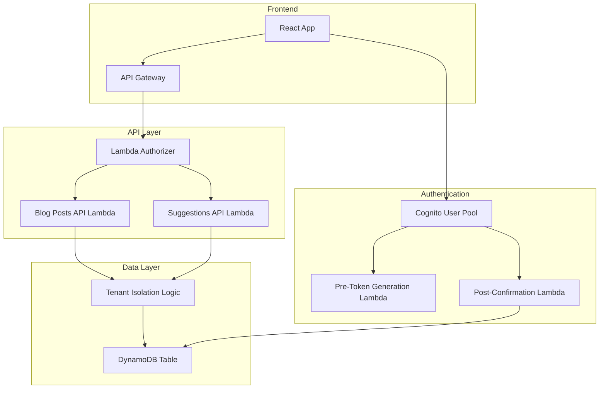
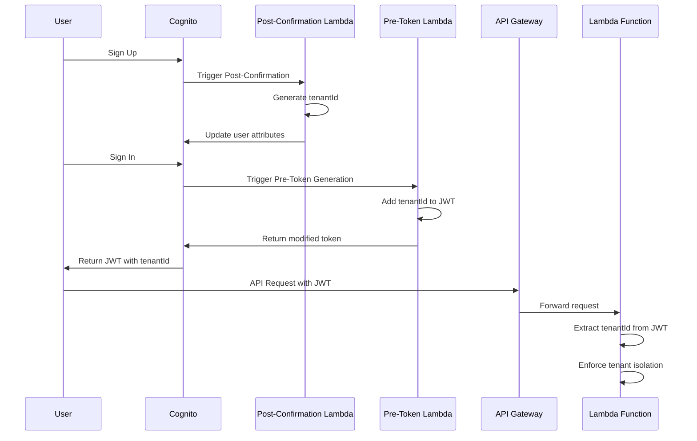
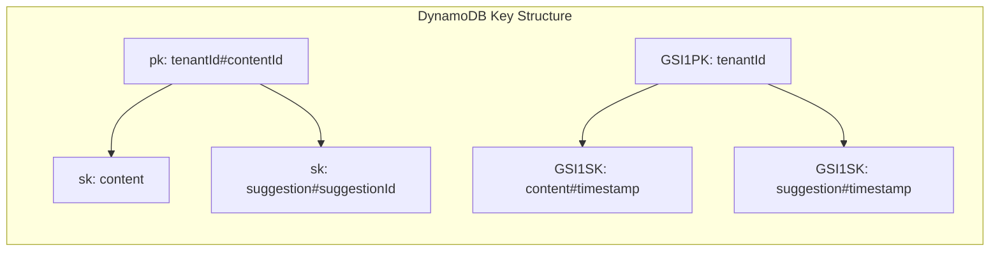

# Design Document

## Overview

The blog API backend provides secure, multi-tenant authentication and CRUD operations for blog posts using Amazon Cognito for user management and AWS Lambda functions for API endpoints. The system automatically generates tenant IDs for new users, includes them in JWT tokens, and enforces strict tenant isolation acrosta operations. The architecture integrates with the existing DynamoDB table and Lambda infrastructure while providing REST API endpoints for the React frontend.

## Architecture

### High-Level Architecture



### Authentication Flow



### Data Model and Tenant Isolation



## Components and Interfaces

### Core Components

#### 1. Cognito User Pool Configuration
- **Purpose**: Manages user authentication and stores tenant context
- **Custom Attributes**:
  - `custom:tenantId` (String, Read-only): Unique tenant identifier
- **Lambda Triggers**:
  - Post-Confirmation: Generates and assigns tenantId
  - Pre-Token Generation: Injects tenantId into JWT tokens
- **Security**: Email verification required, strong password policy

#### 2. Post-Confirmation Lambda Trigger
- **Purpose**: Automatically generates tenantId for new users
- **Trigger**: Executes after successful user confirmation
- **Logic**:
  ```javascript
  export const handler = async (event) => {
    const tenantId = generateTenantId(); // UUID v4
    await updateUserAttributes(event.userPoolId, event.userName, {
      'custom:tenantId': tenantId
    });
    return event;
  };
  ```

#### 3. Pre-Token Generation Lambda Trigger
- **Purpose**: Injects tenantId into JWT tokens
- **Trigger**: Executes before token generation
- **Logic**:
  ```javascript
  export const handler = async (event) => {
    event.response.claimsOverrideDetails = {
      claimsToAddOrOverride: {
        tenantId: event.request.userAttributes['custom:tenantId']
      }
    };
    return event;
  };
  ```

#### 4. Blog Posts API Lambda
- **Purpose**: Handles CRUD operations for blog posts
- **Endpoints** (with stage name `api`):
  - `GET /posts` - List user's posts
  - `GET /posts/{id}` - Get specific post
  - `POST /posts` - Create new post
  - `PUT /posts/{id}` - Update existing post
  - `DELETE /posts/{id}` - Delete post
- **Authentication**: Receives tenantId and userId from Lambda Authorizer context
- **Tenant Isolation**: All operations scoped to tenantId from authorizer context

#### 5. Suggestions API Lambda
- **Purpose**: Handles suggestion retrieval and deletion
- **Endpoints** (with stage name `api`):
  - `GET /posts/{id}/suggestions` - Get suggestions for a post
  - `DELETE /suggestions/{id}` - Delete a specific suggestion
- **Authentication**: Receives tenantId and userId from Lambda Authorizer context
- **Tenant Isolation**: Verifies suggestion belongs to user's tenant using context

#### 6. Lambda Authorizer
- **Purpose**: Validates JWT tokens and injects tenant context into API Gateway
- **Functionality**:
  - JWT signature verification against Cognito public keys
  - Token expiration validation
  - tenantId extraction from custom claims
  - Returns IAM policy with tenant context
- **Integration**: API Gateway authorizer for all protected endpoints
- **Context Injection**: Passes tenantId and userId to Lambda functions via event context

### API Interfaces

#### BlogPost Data Model
```typescript
interface BlogPost {
  id: string;                    // contentId
  tenantId: string;             // extracted from JWT
  title: string;
  body: string;
  status: 'draft' | 'review' | 'finalized' | 'published' | 'abandoned';
  version: number;
  createdAt: number;            // Unix timestamp
  updatedAt: number;            // Unix timestamp
  authorId: string;             // Cognito user sub
}
```

#### Suggestion Data Model
```typescript
interface Suggestion {
  id: string;                   // suggestionId
  contentId: string;            // parent blog post ID
  tenantId: string;             // for tenant isolation
  startOffset: number;
  endOffset: number;
  textToReplace: string;
  replaceWith: string;
  reason: string;
  priority: 'low' | 'medium' | 'high';
  type: 'llm' | 'brand' | 'fact' | 'grammar' | 'spelling';
  contextBefore: string;
  contextAfter: string;
  anchorText: string;
  createdAt: number;
}
```

#### JWT Token Structure
```typescript
interface JWTPayload {
  sub: string;                  // Cognito user ID
  email: string;                // User email
  tenantId: string;             // Custom claim for tenant isolation
  aud: string;                  // Audience
  iss: string;                  // Issuer
  exp: number;                  // Expiration
  iat: number;                  // Issued at
}
```

### OpenAPI Specification

The API will be defined using OpenAPI 3.0 specification with AWS API Gateway extensions. The API will be deployed with stage name `api` and endpoints will be:

- `GET /posts` - List user's posts
- `GET /posts/{id}` - Get specific post
- `POST /posts` - Create new post
- `PUT /posts/{id}` - Update existing post
- `DELETE /posts/{id}` - Delete post
- `GET /posts/{id}/suggestions` - Get suggestions for a post
- `DELETE /suggestions/{id}` - Delete a specific suggestion

#### OpenAPI Structure Example
```yaml
openapi: 3.0.0
info:
  title: Blog API
  version: 1.0.0
  description: Multi-tenant blog post management API

paths:
  /posts:
    get:
      summary: List user's blog posts
      tags: [Posts]
      responses:
        200:
          description: List of blog posts
          content:
            application/json:
              schema:
                type: array
                items:
                  $ref: "#/components/schemas/BlogPost"
        401:
          $ref: "#/components/responses/Unauthorized"
        500:
          $ref: "#/components/responses/InternalError"
      x-amazon-apigateway-integration:
        uri:
          Fn::Sub: arn:${AWS::Partition}:apigateway:${AWS::Region}:lambda:path/2015-03-31/functions/${ListPostsFunction.Arn}/invocations
        httpMethod: POST
        type: aws_proxy

  /posts/{id}:
    parameters:
      - name: id
        in: path
        required: true
        schema:
          type: string
        description: The blog post ID
    get:
      summary: Get specific blog post
      tags: [Posts]
      responses:
        200:
          description: Blog post details
          content:
            application/json:
              schema:
                $ref: "#/components/schemas/BlogPost"
        401:
          $ref: "#/components/responses/Unauthorized"
        403:
          $ref: "#/components/responses/Forbidden"
        404:
          $ref: "#/components/responses/NotFound"
        500:
          $ref: "#/components/responses/InternalError"
      x-amazon-apigateway-integration:
        uri:
          Fn::Sub: arn:${AWS::Partition}:apigateway:${AWS::Region}:lambda:path/2015-03-31/functions/${GetPostFunction.Arn}/invocations
        httpMethod: POST
        type: aws_proxy

components:
  schemas:
    BlogPost:
      type: object
      properties:
        id:
          type: string
        title:
          type: string
        body:
          type: string
        status:
          type: string
          enum: [draft, review, finalized, published, abandoned]
        version:
          type: integer
        createdAt:
          type: integer
        updatedAt:
          type: integer
        authorId:
          type: string
  responses:
    Unauthorized:
      description: Authentication required
    Forbidden:
      description: Access denied
    NotFound:
      description: Resource not found
    InternalError:
      description: Internal server error
```

#### Authentication Headers
All API requests must include:
```
Authorization: Bearer <JWT_TOKEN>
Content-Type: application/json
```

## Data Models

### DynamoDB Key Structure

#### Primary Key Pattern
```javascript
// Blog Post
pk: `${tenantId}#${contentId}`
sk: 'content'

// Suggestion
pk: `${tenantId}#${contentId}`
sk: `suggestion#${suggestionId}`
```

#### GSI1 Pattern (for tenant-wide queries)
```javascript
// Blog Posts by tenant
GSI1PK: `${tenantId}`
GSI1SK: `content#${timestamp}`

// Suggestions by tenant
GSI1PK: `${tenantId}`
GSI1SK: `suggestion#${timestamp}`
```

### Tenant Isolation Strategy

#### Data Segregation
- All data operations include tenantId in the primary key
- GSI queries are scoped to tenantId
- No cross-tenant data access possible at the database level

#### Access Control
- JWT tokens contain tenantId as a custom claim
- All API functions validate tenantId from JWT
- Database operations use tenantId from authenticated context
- No user-provided tenantId accepted in API requests

## Error Handling

### Error Types and HTTP Status Codes

#### Authentication Errors (401)
- Missing JWT token
- Invalid JWT signature
- Expired JWT token
- Missing tenantId claim

#### Authorization Errors (403)
- Resource belongs to different tenant
- Insufficient permissions for operation

#### Client Errors (400)
- Invalid request body format
- Missing required fields
- Invalid field values

#### Not Found Errors (404)
- Blog post doesn't exist
- Suggestion doesn't exist

#### Server Errors (500)
- DynamoDB operation failures
- Cognito service errors
- Unexpected system errors

### Error Response Format
```typescript
interface ErrorResponse {
  error: string;              // Error type
  message: string;            // Human-readable message
  details?: any;              // Additional error context (non-production)
}
```

### Logging Strategy
- Structured JSON logging for all operations
- Include tenantId, userId, and operation context
- Log errors with stack traces (server-side only)
- No sensitive data in logs (passwords, tokens)

## Testing Strategy

Testing will be deferred for the initial hackathon implementation to prioritize rapid development and deployment. Future iterations will include comprehensive testing coverage.

## Technology Stack

### Authentication
- **Amazon Cognito User Pools**: User management and JWT token generation
- **Lambda Triggers**: Custom business logic for user lifecycle events
- **JWT Libraries**: Token validation and parsing

### API Layer
- **AWS Lambda**: Serverless compute for API endpoints
- **Amazon API Gateway**: HTTP API routing and request/response transformation
- **Node.js 22.x**: Runtime environment with ES modules

### Data Layer
- **Amazon DynamoDB**: NoSQL database with global secondary indexes
- **AWS SDK v3**: Modular AWS service clients
- **DynamoDB Utilities**: Marshall/unmarshall for data transformation

### Development Tools
- **AWS SAM**: Infrastructure as code and local development
- **esbuild**: Fast JavaScript bundling and minification
- **Zod**: Runtime type validation for API inputs
- **Jest**: Unit testing framework

### Monitoring and Observability
- **AWS X-Ray**: Distributed tracing for request flows
- **CloudWatch Logs**: Centralized logging with structured JSON
- **CloudWatch Metrics**: Custom metrics for business KPIs
- **AWS CloudTrail**: API call auditing and compliance
