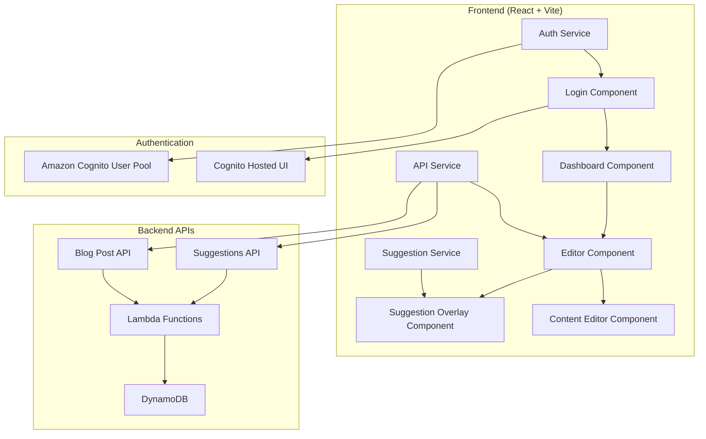

# Design Document

## Overview

The blog editor UI is a React-based single-page application that provides authors with an intuitive interface for creating and eblog posts with AI-powered suggestions. The application uses Vite for build tooling, Tailwind CSS for styling, and Amazon Cognito for authentication. It communicates with the existing AWS Lambda backend through REST APIs and provides real-time suggestion highlighting with one-click accept/reject functionality.

## Architecture

### High-Level Architecture



### Component Hierarchy

```
App
├── AuthProvider (Context)
├── Router
│   ├── LoginPage
│   ├── DashboardPage
│   │   └── PostList
│   └── EditorPage
│       ├── EditorHeader
│       ├── ContentEditor
│       │   ├── TextEditor
│       │   └── SuggestionOverlay
│       │       ├── SuggestionHighlight
│       │       └── SuggestionPopover
│       └── EditorActions
└── ApiProvider (Context)
```

## Components and Interfaces

### Core Components

#### 1. AuthProvider
- **Purpose**: Manages Amazon Cognito authentication state
- **Props**: `children: ReactNode`
- **State**: `user: CognitoUser | null, isLoading: boolean, isAuthenticated: boolean`
- **Methods**: `login(), logout(), refreshToken()`

#### 2. ApiService
- **Purpose**: Handles all REST API communications
- **Methods**:
  - `getPosts(): Promise<BlogPost[]>`
  - `getPost(id: string): Promise<BlogPost>`
  - `createPost(post: CreatePostRequest): Promise<BlogPost>`
  - `updatePost(id: string, post: UpdatePostRequest): Promise<BlogPost>`
  - `getSuggestions(contentId: string): Promise<Suggestion[]>`
  - `deleteSuggestion(suggestionId: string): Promise<void>`

#### 3. ContentEditor
- **Purpose**: Main editing interface with suggestion integration
- **Props**: `post: BlogPost, onSave: (post: BlogPost) => void`
- **State**: `content: string, suggestions: Suggestion[], selectedSuggestion: string | null`
- **Features**: Real-time editing, auto-save, suggestion highlighting

#### 4. SuggestionOverlay
- **Purpose**: Renders suggestion highlights and interaction UI
- **Props**: `suggestions: Suggestion[], content: string, onAccept: (id: string) => void, onReject: (id: string) => void`
- **Features**: Text highlighting with type-specific colors, popover positioning, click handling
- **Color Scheme**:
  - `llm`: Blue highlighting (`bg-blue-200 border-blue-400`)
  - `brand`: Purple highlighting (`bg-purple-200 border-purple-400`)
  - `fact`: Orange highlighting (`bg-orange-200 border-orange-400`)
  - `grammar`: Green highlighting (`bg-green-200 border-green-400`)
  - `spelling`: Red highlighting (`bg-red-200 border-red-400`)

### API Interfaces

#### BlogPost Interface
```typescript
interface BlogPost {
  id: string;
  title: string;
  body: string;
  status: 'draft' | 'review' | 'finalized' | 'published' | 'abandoned';
  version: number;
  createdAt: number;
  updatedAt: number;
  authorId: string;
}
```

#### Suggestion Interface
```typescript
interface Suggestion {
  id: string;
  contentId: string;
  startOffset: number;
  endOffset: number;
  textToReplace: string;
  replaceWith: string;
  reason: string;
  priority: 'low' | 'medium' | 'high';
  type: 'llm' | 'brand' | 'fact' | 'grammar' | 'spelling';
  contextBefore: string;
  contextAfter: string;
  anchorText: string;
  createdAt: number;
}
```

#### REST API Endpoints
- `GET /api/posts` - List user's blog posts
- `GET /api/posts/{id}` - Get specific blog post
- `POST /api/posts` - Create new blog post
- `PUT /api/posts/{id}` - Update existing blog post
- `GET /api/posts/{id}/suggestions` - Get suggestions for a post
- `DELETE /api/suggestions/{id}` - Delete a suggestion
- `POST /api/posts/{id}/submit-review` - Submit post for additional review
- `POST /api/posts/{id}/finalize` - Finalize the draft

## Data Models

### Frontend State Management

#### AuthContext
```typescript
interface AuthContextType {
  user: CognitoUser | null;
  isLoading: boolean;
  isAuthenticated: boolean;
  login: () => Promise<void>;
  logout: () => Promise<void>;
  getToken: () => Promise<string>;
}
```

#### EditorState
```typescript
interface EditorState {
  post: BlogPost | null;
  content: string;
  suggestions: Suggestion[];
  selectedSuggestion: string | null;
  isDirty: boolean;
  isSaving: boolean;
  lastSaved: Date | null;
}
```

### Local Storage Schema
- `auth_token`: Cognito JWT token
- `draft_content_{postId}`: Auto-saved content
- `editor_preferences`: User interface preferences

## Error Handling

### Error Types and Handling Strategy

#### Authentication Errors
- **Token Expiry**: Automatic refresh with fallback to re-login
- **Invalid Credentials**: Clear error messaging with retry option
- **Network Issues**: Offline mode with local storage backup

#### API Errors
- **Network Failures**: Retry mechanism with exponential backoff
- **Server Errors (5xx)**: User-friendly error messages with retry option
- **Client Errors (4xx)**: Specific error handling based on error code
- **Rate Limiting**: Queue requests with user notification

#### Suggestion Processing Errors
- **Invalid Offsets**: Skip malformed suggestions with console warning
- **Conflicting Suggestions**: Prioritize by type and timestamp
- **Missing Context**: Graceful degradation without suggestion highlighting

### Error UI Components
- **ErrorBoundary**: Catches React component errors
- **Toast Notifications**: Non-blocking error and success messages
- **Inline Validation**: Real-time form validation feedback
- **Retry Mechanisms**: User-initiated retry for failed operations

## Testing Strategy

### Unit Testing
- **Components**: React Testing Library for component behavior
- **Services**: Jest for API service methods and authentication logic
- **Utilities**: Pure function testing for suggestion processing
- **Hooks**: Custom hook testing with React Hooks Testing Library

### Integration Testing
- **API Integration**: Mock API responses for different scenarios
- **Authentication Flow**: End-to-end Cognito integration testing
- **Suggestion Workflow**: Complete accept/reject flow testing
- **Error Scenarios**: Network failure and error recovery testing

### E2E Testing
- **User Workflows**: Complete user journeys from login to publish
- **Cross-browser**: Chrome, Firefox, Safari compatibility
- **Responsive Design**: Mobile and desktop layout testing
- **Performance**: Load time and interaction responsiveness

### Test Data Management
- **Mock Data**: Realistic blog posts and suggestions for testing
- **Test Users**: Cognito test user pool for authentication testing
- **API Mocking**: MSW (Mock Service Worker) for API simulation
- **Snapshot Testing**: UI component regression testing

## Technology Stack

### Frontend Framework
- **React 18**: Component-based UI with hooks and context
- **TypeScript**: Type safety and developer experience
- **Vite**: Fast build tool with HMR and optimized bundling

### Styling and UI
- **Tailwind CSS**: Utility-first CSS framework with custom color palette for suggestion types
- **Headless UI**: Accessible component primitives
- **Heroicons**: Consistent icon library
- **Framer Motion**: Smooth animations and transitions
- **Suggestion Color System**: Type-based color coding for visual distinction
  - LLM suggestions: Blue theme
  - Brand suggestions: Purple theme
  - Fact suggestions: Orange theme
  - Grammar suggestions: Green theme
  - Spelling suggestions: Red theme

### State Management
- **React Context**: Authentication and global state
- **React Query**: Server state management and caching
- **Local Storage**: Offline draft persistence

### Authentication
- **AWS Amplify Auth**: Cognito integration library
- **JWT Handling**: Token management and refresh logic

### Development Tools
- **ESLint**: Code linting and style enforcement
- **Prettier**: Code formatting
- **Husky**: Git hooks for quality gates
- **Vitest**: Fast unit testing framework
