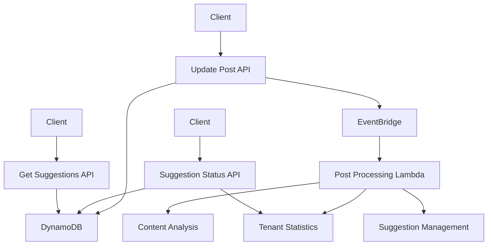

# Design Document

## Overview

The Enhanced Post Update System redesigns the existing update-post functionality to provide intellion management, asynchronous content processing, and comprehensive suggestion lifecycle management. The system uses EventBridge for decoupling synchronous API responses from background processing, ensuring fast user experience while maintaining data consistency and providing robust suggestion management capabilities.

## Architecture

### Breaking Changes Note

This design consolidates the "finalized" and "published" statuses into a single "published" status. This is a breaking change that will require updates to:
- Frontend UI components and status handling
- API validation schemas
- OpenAPI specification
- Existing database records with "finalized" status

### High-Level Architecture



### Component Interaction Flow

1. **Synchronous Phase**: Update Post API validates input, updates post data, and publishes event
2. **Asynchronous Phase**: Background processor handles content analysis and suggestion management
3. **Status Management**: Separate API handles suggestion status updates with immediate statistics tracking

## Components and Interfaces

### 1. Enhanced Update Post API

**Purpose**: Handle post updates with intelligent version management and trigger background processing

**Key Changes**:
- Version increment logic based on body content changes
- EventBridge event publication for background processing
- Return 204 status with empty body for successful updates

**Interface**:
```javascript
PUT /posts/{id}
{
  "title": "string (optional)",
  "body": "string (optional)",
  "status": "draft|review|published|abandoned (optional)"
}

Response: 204 No Content
```

**Version Management Logic**:
```javascript
const shouldIncrementVersion = (currentBody, newBody) => {
  return newBody !== undefined && newBody !== currentBody;
};
```

### 2. Post Processing Lambda

**Purpose**: Handle asynchronous content analysis and suggestion management triggered by EventBridge events

**Event Structure**:
```javascript
{
  "source": "blog-api",
  "detail-type": "Post Updated",
  "detail": {
    "tenantId": "string",
    "postId": "string",
    "version": "number",
    "bodyChanged": "boolean",
    "statusChanged": "boolean",
    "newStatus": "string"
  }
}
```

**Processing Logic**:
1. Load current post content from DynamoDB using tenantId and postId
2. If `bodyChanged` is true:
   - Query all pending suggestions for the post
   - Validate each suggestion's anchor text and context against current body
   - Mark suggestions as "skipped" if anchor text/context not found
   - Update remaining valid suggestions to current version
   - Trigger new content analysis workflow
3. If `newStatus` is "published": mark all remaining pending suggestions as rejected
4. Update tenant statistics based on suggestion changes

### 3. Suggestion Status Management API

**Purpose**: Provide endpoint for managing individual suggestion statuses

**Interface**:
```javascript
POST /posts/{postId}/suggestions/{suggestionId}/statuses
{
  "status": "accepted|rejected|deleted"
}

Response: 204 No Content
```

**Implementation**: Repurpose existing delete-suggestion function with enhanced logic

### 4. Enhanced Get Suggestions API

**Purpose**: Return only pending suggestions for active review

**Filter Logic**: Add DynamoDB filter expression to only return suggestions with status "pending"

**Interface**:
```javascript
GET /posts/{id}/suggestions

Response: 200 OK
[
  {
    "id": "string",
    "status": "pending", // Only pending suggestions returned
    // ... other suggestion fields
  }
]
```

## Data Models

### Post Record (Enhanced)

```javascript
{
  pk: "tenantId#postId",
  sk: "content",
  contentId: "string",
  title: "string",
  body: "string",
  status: "draft|review|published|abandoned",
  version: "number", // Incremented only when body changes
  createdAt: "timestamp",
  updatedAt: "timestamp", // Always updated
  authorId: "string"
}
```

### Suggestion Record (Enhanced)

```javascript
{
  pk: "tenantId#postId",
  sk: "suggestion#suggestionId",
  suggestionId: "string",
  contentId: "string",
  version: "number", // Updated to match current post version when still valid
  status: "pending|accepted|rejected|deleted|skipped", // New status field
  startOffset: "number",
  endOffset: "number",
  textToReplace: "string",
  replaceWith: "string",
  reason: "string",
  priority: "number",
  type: "string",
  contextBefore: "string",
  contextAfter: "string",
  anchorText: "string",
  createdAt: "timestamp",
  updatedAt: "timestamp" // New field for status changes
}
```

### Tenant Statistics Record (New)

```javascript
{
  pk: "tenantId",
  sk: "stats",
  totalSuggestions: "number",
  acceptedSuggestions: "number",
  rejectedSuggestions: "number",
  skippedSuggestions: "number",
  deletedSuggestions: "number",
  suggestionsByType: {
    "grammar": { "total": "number", "accepted": "number", "rejected": "number" },
    "spelling": { "total": "number", "accepted": "number", "rejected": "number" },
    "style": { "total": "number", "accepted": "number", "rejected": "number" },
    "fact": { "total": "number", "accepted": "number", "rejected": "number" },
    "brand": { "total": "number", "accepted": "number", "rejected": "number" }
  },
  createdAt: "timestamp",
  updatedAt: "timestamp"
}
```

## Error Handling

### Update Post API Error Scenarios

1. **Validation Errors**: Return 400 with detailed validation messages
2. **Post Not Found**: Return 404 with appropriate message
3. **Access Denied**: Return 403 when post doesn't belong to tenant
4. **Database Errors**: Return 500 with generic error message, log details

### Background Processing Error Handling

1. **Content Analysis Failures**: Log errors, continue with suggestion management
2. **Suggestion Validation Errors**: Log individual failures, process remaining suggestions
3. **Statistics Update Failures**: Log errors, don't block other processing

### Suggestion Status API Error Scenarios

1. **Invalid Status Values**: Return 400 with list of valid statuses
2. **Suggestion Not Found**: Return 404
3. **Post Ownership Validation**: Return 403 for access violations

## Testing Strategy

### Unit Testing Focus

1. **Version Increment Logic**: Test various scenarios of body changes vs metadata changes
2. **Event Publishing**: Verify correct EventBridge event structure and content
3. **Suggestion Validation**: Test anchor text matching and context validation logic
4. **Statistics Calculations**: Verify accurate counter updates and aggregations

### Integration Testing Scenarios

1. **End-to-End Post Update Flow**: Update post → verify event → check background processing results
2. **Suggestion Lifecycle**: Create suggestions → update post → verify suggestion status changes
3. **Status Management Flow**: Update suggestion status → verify statistics updates
4. **Cross-Tenant Isolation**: Verify tenant data separation in all operations

### Performance Testing Considerations

1. **API Response Times**: Ensure update-post returns quickly (< 200ms) regardless of background processing
2. **Background Processing Throughput**: Test handling of multiple concurrent post updates
3. **Database Query Performance**: Optimize suggestion queries with proper indexing
4. **EventBridge Throughput**: Verify event processing under load

## Security Considerations

### Authentication and Authorization

1. **Tenant Isolation**: All operations must validate tenant ownership
2. **Post Ownership**: Verify user has access to specific posts
3. **Suggestion Access**: Ensure suggestions can only be managed by post owners

### Input Validation

1. **Request Body Validation**: Use Zod schemas for all API inputs
2. **Status Value Validation**: Whitelist allowed suggestion status values
3. **Content Sanitization**: Validate post content for appropriate length and format

### Data Protection

1. **Audit Logging**: Log all suggestion status changes for audit trails
2. **Soft Deletes**: Consider soft deletes for suggestions to maintain audit history
3. **Statistics Integrity**: Ensure statistics accurately reflect actual suggestion outcomes

## Performance Optimization

### Database Optimization

1. **Query Patterns**: Optimize DynamoDB queries for suggestion filtering by status
2. **Batch Operations**: Use batch operations for bulk suggestion updates
3. **Connection Reuse**: Maintain DynamoDB client connections across Lambda invocations

### Background Processing Optimization

1. **Parallel Processing**: Process suggestion validation and content analysis concurrently
2. **Batch Statistics Updates**: Aggregate multiple statistics changes into single updates
3. **Error Recovery**: Implement retry logic for transient failures

### Caching Strategy

1. **Post Content Caching**: Cache frequently accessed post content for suggestion validation
2. **Statistics Caching**: Consider caching tenant statistics for read-heavy scenarios
3. **Suggestion Counts**: Cache suggestion counts to avoid repeated queries
