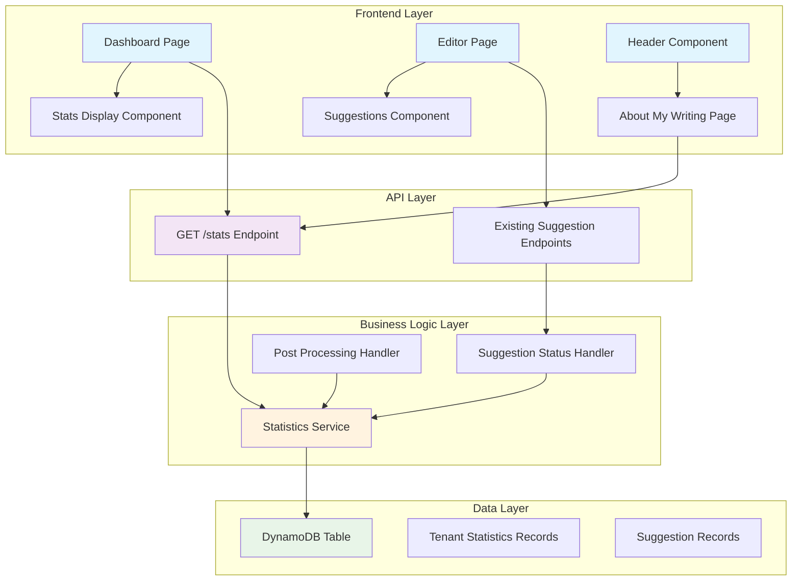

# Design Document

## Overview

This design implements a comprehensive suggestion statistics system that automatically tracks user interactions with AI-generated suggestions, provides real-time statistics through API endpoints, and integrates statistics display throughout the user interface. The system builds upon the existing tenant statistics infrastructure and extends it with new API endpoints and UI components.

## Architecture

### System Components



### Data Flow

1. **Statistics Updates**: When suggestions are modified via API or post-processing, the system automatically updates tenant statistics
2. **Statistics Retrieval**: The GET /stats endpoint retrieves current statistics and post counts for display
3. **UI Integration**: Frontend components consume statistics through the API and display them in dashboard and detailed views
4. **Real-time Updates**: Statistics are updated immediately when suggestion statuses change

## Components and Interfaces

### Backend Components

#### 1. GET /stats API Endpoint

**Location**: `functions/api/get-stats.mjs`

**Purpose**: Retrieve comprehensive statistics and AI-powered writing insights for the authenticated tenant

**Changes**: Simplified to use stored post count from tenant statistics instead of querying database

**Interface**:
```javascript
// Request: GET /stats
// Response: 200 OK
{
  "totalPosts": 15,
  "totalSuggestions": 127,
  "acceptedSuggestions": 89,
  "rejectedSuggestions": 23,
  "skippedSuggestions": 12,
  "deletedSuggestions": 3,
  "acceptanceRate": 0.70,
  "suggestionsByType": {
    "grammar": { "total": 45, "accepted": 32, "rejected": 8 },
    "spelling": { "total": 23, "accepted": 20, "rejected": 3 },
    "style": { "total": 34, "accepted": 22, "rejected": 7 },
    "fact": { "total": 15, "accepted": 10, "rejected": 3 },
    "brand": { "total": 10, "accepted": 5, "rejected": 2 }
  },
  "insights": [
    {
      "type": "strength",
      "category": "writing_style",
      "message": "Your writing consistently demonstrates clear structure and logical flow",
      "confidence": 0.85
    },
    {
      "type": "improvement",
      "category": "grammar",
      "message": "Consider reviewing comma usage in complex sentences",
      "confidence": 0.72
    }
  ],
  "writingPatterns": {
    "averagePostLength": 1250,
    "commonTopics": ["technology", "productivity"],
    "writingTrends": "Increasingly concise over time"
  }
}
```

#### 2. Enhanced Statistics Integration

**Existing Components to Modify**:
- `functions/api/update-suggestion-status.mjs` - Already integrated
- `functions/api/post-processing.mjs` - Already integrated
- `functions/utils/tenant-statistics.mjs` - Add post counting functions
- `functions/api/create-post.mjs` - Add post count increment
- `functions/api/delete-post.mjs` - Add post count decrement
- `functions/api/get-stats.mjs` - Simplify to use stored post count

**New Functionality**:
- Post counting functions in tenant statistics utility
- Post count increment/decrement in create/delete operations
- Simplified stats retrieval using stored counts

#### 3. Post Count Tracking

**Location**: `functions/utils/tenant-statistics.mjs`

**Purpose**: Track post counts in tenant statistics record for efficient retrieval

**New Functions**:
```javascript
// Increment post count when creating posts
export const incrementPostCount = async (tenantId) => {
  // Increment totalPosts counter in tenant statistics
}

// Decrement post count when deleting posts
export const decrementPostCount = async (tenantId) => {
  // Decrement totalPosts counter in tenant statistics
}
```

**Updated Statistics Record Structure**:
```javascript
{
  pk: tenantId,
  sk: 'stats',
  totalPosts: 0,           // NEW: Track post count
  totalSuggestions: 0,
  acceptedSuggestions: 0,
  rejectedSuggestions: 0,
  skippedSuggestions: 0,
  deletedSuggestions: 0,
  suggestionsByType: { ... },
  createdAt: timestamp,
  updatedAt: timestamp
}
```

### Frontend Components

#### 1. Dashboard Statistics Display

**Location**: `blog-editor-ui/src/components/dashboard/StatsOverview.tsx`

**Purpose**: Display high-level metrics on the dashboard

**Interface**:
```typescript
interface StatsOverviewProps {
  stats: TenantStats;
  isLoading: boolean;
}

interface TenantStats {
  totalPosts: number;
  totalSuggestions: number;
  acceptanceRate: number;
}
```

#### 2. About My Writing Page

**Location**: `blog-editor-ui/src/pages/AboutMyWritingPage.tsx`

**Purpose**: Detailed statistics and writing insights with AI-powered analysis

**Features**:
- Comprehensive statistics breakdown by type and status
- Visual charts for suggestion trends
- AI-powered writing insights from agent memory analysis
- Personalized writing improvement recommendations
- Historical data visualization
- Writing pattern analysis from long-term memory

#### 3. Header Context Menu

**Location**: `blog-editor-ui/src/components/layout/Header.tsx`

**Enhancement**: Add context menu to avatar with "About My Writing" option

#### 4. Editor Suggestions Integration

**Location**: `blog-editor-ui/src/components/editor/SuggestionsPanel.tsx`

**Purpose**: Display and interact with suggestions in the editor

**Features**:
- Group suggestions by type with color coding
- Accept/reject/modify suggestion actions
- Real-time status updates
- Visual feedback for actions

## Data Models

### Statistics API Response

```typescript
interface StatsResponse {
  totalPosts: number;
  totalSuggestions: number;
  acceptedSuggestions: number;
  rejectedSuggestions: number;
  skippedSuggestions: number;
  deletedSuggestions: number;
  acceptanceRate: number;
  suggestionsByType: {
    [key in SuggestionType]: {
      total: number;
      accepted: number;
      rejected: number;
    };
  };
  insights: WritingInsight[];
  writingPatterns: {
    averagePostLength: number;
    commonTopics: string[];
    writingTrends: string;
  };
}

interface WritingInsight {
  type: 'strength' | 'improvement' | 'observation';
  category: 'writing_style' | 'grammar' | 'content' | 'structure';
  message: string;
  confidence: number;
}
```

### Enhanced Suggestion Interface

```typescript
interface SuggestionWithActions extends Suggestion {
  status: 'pending' | 'accepted' | 'rejected' | 'deleted' | 'skipped';
  onAccept: () => Promise<void>;
  onReject: () => Promise<void>;
  onDelete: () => Promise<void>;
}
```

### Statistics Service Interface

```typescript
interface StatisticsService {
  getStats(tenantId: string): Promise<StatsResponse>;
  updateSuggestionStatus(
    tenantId: string,
    suggestionType: SuggestionType,
    newStatus: string,
    oldStatus?: string
  ): Promise<void>;
  calculateAcceptanceRate(stats: TenantStatistics): number;
}
```

## Error Handling

### Backend Error Handling

1. **Statistics Retrieval Errors**:
   - Return zero values for missing statistics records
   - Log errors but don't fail API responses
   - Handle DynamoDB access errors gracefully

2. **Statistics Update Errors**:
   - Log errors but don't block primary operations
   - Implement retry logic for transient failures
   - Maintain data consistency

### Frontend Error Handling

1. **API Failures**:
   - Show loading states during API calls
   - Display user-friendly error messages
   - Provide retry mechanisms for failed requests

2. **Statistics Display**:
   - Show placeholder content when data is unavailable
   - Handle zero-state scenarios gracefully
   - Provide clear feedback for empty statistics

## Testing Strategy

### Backend Testing

1. **Unit Tests**:
   - Statistics calculation functions
   - API endpoint handlers
   - Error handling scenarios

2. **Integration Tests**:
   - End-to-end statistics update flow
   - API endpoint responses
   - DynamoDB operations

### Frontend Testing

1. **Component Tests**:
   - Statistics display components
   - Suggestion interaction components
   - Error state handling

2. **User Experience Tests**:
   - Manual testing of complete user flows
   - Statistics accuracy verification
   - UI responsiveness testing

## Implementation Considerations

### Performance Optimizations

1. **Statistics Caching**:
   - Cache frequently accessed statistics
   - Implement efficient DynamoDB queries
   - Use appropriate TTL for cached data

2. **UI Performance**:
   - Lazy load detailed statistics
   - Implement efficient re-rendering
   - Use React.memo for expensive components

### Security Considerations

1. **Data Access**:
   - Ensure tenant isolation for all statistics
   - Validate user permissions for statistics access
   - Sanitize all user inputs

2. **API Security**:
   - Use existing authentication mechanisms
   - Implement proper error handling without data leakage
   - Follow existing security patterns

### Scalability Considerations

1. **Database Design**:
   - Use existing DynamoDB patterns
   - Implement efficient query patterns
   - Consider future statistics requirements

2. **API Design**:
   - Design for future extensibility
   - Implement proper pagination if needed
   - Follow existing API conventions

## Integration Points

### Existing System Integration

1. **Authentication**: Use existing JWT-based authentication
2. **Database**: Extend existing DynamoDB table structure
3. **API Gateway**: Add new endpoint to existing API
4. **Frontend**: Integrate with existing React application structure

### External Dependencies

1. **AWS SDK**: Use existing DynamoDB client patterns
2. **React**: Follow existing component patterns
3. **TypeScript**: Use existing type definitions and patterns
4. **Styling**: Use existing Tailwind CSS classes and patterns
