# Betterer Achitecture Overview

This project is an AI-powered blog review platform built on AWS, specifically using Amazon Bedrock, Amazon Nova models, Bedrock AgentCore, Step Functions, Lambda, EventBridge, and DynamoDB to provide intelligent content analysis and suggestions.

## System Architecture

```mermaid
graph TB
    %% Frontend Layer
    subgraph "Frontend (React + TypeScript)"
        UI[Blog Editor UI<br/>React/Vite/Tailwind]
        AUTH[AWS Amplify Auth<br/>Cognito Integration]
        QUERY[React Query<br/>State Management]
    end

    %% API Gateway Layer
    subgraph "API Layer"
        APIGW[API Gateway<br/>REST API]
        AUTHORIZER[Lambda Authorizer<br/>JWT Validation]
    end

    %% Authentication Services
    subgraph "Authentication"
        COGNITO[Amazon Cognito<br/>User Pool]
        POSTCNF[Post Confirmation<br/>Lambda Trigger]
        PRETOKEN[Pre Token Generation<br/>Lambda Trigger]
    end

    %% Core API Functions
    subgraph "Content API (Lambda Functions)"
        LISTPOSTS[List Posts]
        GETPOST[Get Post]
        CREATEPOST[Create Post]
        UPDATEPOST[Update Post]
        DELETEPOST[Delete Post]
        GETSUGG[Get Suggestions]
        UPDATESUGG[Update Suggestion Status]
        STARTREVIEW[Start Review]
        GETSTATS[Get Stats]
        PROFILE[Profile Management<br/>CRUD Operations]
    end

    %% AI Agent Layer - HIGHLIGHTED SECTION
    subgraph "🤖 AI Agents (Amazon Nova + Bedrock)"
        style LLMAUDIT fill:#e1f5fe,stroke:#01579b,stroke-width:3px
        style BRANDAUDIT fill:#e1f5fe,stroke:#01579b,stroke-width:3px
        style FACTCHECK fill:#e1f5fe,stroke:#01579b,stroke-width:3px
        style READABILITY fill:#e1f5fe,stroke:#01579b,stroke-width:3px
        style SUMMARIZER fill:#e1f5fe,stroke:#01579b,stroke-width:3px

        LLMAUDIT[LLM Auditor Agent<br/>🔥 Amazon Nova Pro v1:0<br/>Detects AI-generated content]
        BRANDAUDIT[Brand Audit Agent<br/>🔥 Amazon Nova Lite v1:0<br/>Brand voice alignment]
        FACTCHECK[Fact Checker Agent<br/>🔥 Amazon Nova Pro v1:0<br/>Verifies claims with web search]
        READABILITY[Readability Agent<br/>🔥 Amazon Nova Lite v1:0<br/>Grammar & readability analysis]
        SUMMARIZER[Summary Agent<br/>🔥 Amazon Nova Pro v1:0<br/>Generates audit summaries]
    end

    %% Bedrock AgentCore - HIGHLIGHTED SECTION
    subgraph "🧠 Bedrock AgentCore Memory"
        style AGENTCORE fill:#fff3e0,stroke:#e65100,stroke-width:3px
        style MEMORY fill:#fff3e0,stroke:#e65100,stroke-width:3px

        AGENTCORE[Bedrock AgentCore<br/>Conversation Memory]
        MEMORY[Agent Memory Store<br/>Session & Actor Context]
        MEMBOOTSTRAP[Memory Bootstrap<br/>CloudFormation Custom Resource]
    end

    %% Tools Layer
    subgraph "Agent Tools"
        SAVEAUDIT[Save LLM Audit Tool]
        SAVEBRAND[Save Brand Audit Tool]
        CREATESUGG[Create Suggestions Tool]
        WEBSEARCH[Web Search Tool<br/>SerpAPI Integration]
    end

    %% Orchestration Layer
    subgraph "Content Analysis Workflow"
        STEPFUNC[Step Functions<br/>Analyze Content State Machine]
        EVENTBRIDGE[EventBridge<br/>Event Orchestration]
        POSTPROC[Post Processing<br/>Lambda Function]
    end

    %% Data Layer
    subgraph "Data Storage"
        DYNAMODB[(DynamoDB<br/>Content & Suggestions)]
        S3[(S3 Bucket<br/>Content Storage)]
        SSM[SSM Parameter Store<br/>Agent Memory ID]
    end

    %% External Services
    subgraph "External Integrations"
        SERPAPI[SerpAPI<br/>Web Search]
        MOMENTO[Momento Cache<br/>Real-time Notifications]
    end

    %% Connections
    UI --> APIGW
    AUTH --> COGNITO
    APIGW --> AUTHORIZER
    AUTHORIZER --> COGNITO

    %% API Routes
    APIGW --> LISTPOSTS
    APIGW --> GETPOST
    APIGW --> CREATEPOST
    APIGW --> UPDATEPOST
    APIGW --> DELETEPOST
    APIGW --> GETSUGG
    APIGW --> UPDATESUGG
    APIGW --> STARTREVIEW
    APIGW --> GETSTATS
    APIGW --> PROFILE

    %% Cognito Triggers
    COGNITO --> POSTCNF
    COGNITO --> PRETOKEN

    %% Event-driven Architecture
    UPDATEPOST --> EVENTBRIDGE
    DELETEPOST --> EVENTBRIDGE
    STARTREVIEW --> EVENTBRIDGE
    EVENTBRIDGE --> STEPFUNC
    EVENTBRIDGE --> POSTPROC

    %% Step Functions Orchestration
    STEPFUNC --> LLMAUDIT
    STEPFUNC --> BRANDAUDIT
    STEPFUNC --> FACTCHECK
    STEPFUNC --> READABILITY
    STEPFUNC --> SUMMARIZER

    %% Agent Tools Integration
    LLMAUDIT --> SAVEAUDIT
    LLMAUDIT --> CREATESUGG
    BRANDAUDIT --> SAVEBRAND
    BRANDAUDIT --> CREATESUGG
    FACTCHECK --> WEBSEARCH
    FACTCHECK --> CREATESUGG
    READABILITY --> CREATESUGG

    %% Bedrock AgentCore Integration
    LLMAUDIT -.-> AGENTCORE
    BRANDAUDIT -.-> AGENTCORE
    FACTCHECK -.-> AGENTCORE
    READABILITY -.-> AGENTCORE
    SUMMARIZER -.-> AGENTCORE
    AGENTCORE --> MEMORY
    MEMBOOTSTRAP --> MEMORY

    %% Data Storage
    LISTPOSTS --> DYNAMODB
    GETPOST --> DYNAMODB
    CREATEPOST --> DYNAMODB
    UPDATEPOST --> DYNAMODB
    DELETEPOST --> DYNAMODB
    GETSUGG --> DYNAMODB
    UPDATESUGG --> DYNAMODB
    GETSTATS --> DYNAMODB
    PROFILE --> DYNAMODB

    SAVEAUDIT --> DYNAMODB
    SAVEBRAND --> DYNAMODB
    CREATESUGG --> DYNAMODB
    SUMMARIZER --> DYNAMODB

    %% Memory Management
    LLMAUDIT --> SSM
    BRANDAUDIT --> SSM
    FACTCHECK --> SSM
    READABILITY --> SSM
    SUMMARIZER --> SSM
    GETSTATS --> SSM

    %% External Integrations
    WEBSEARCH --> SERPAPI
    STARTREVIEW --> MOMENTO

    %% Content Storage
    CREATEPOST --> S3
    UPDATEPOST --> S3

    %% Styling for key components
    classDef novaModel fill:#e3f2fd,stroke:#1976d2,stroke-width:2px
    classDef agentCore fill:#fff3e0,stroke:#f57c00,stroke-width:2px
    classDef bedrock fill:#f3e5f5,stroke:#7b1fa2,stroke-width:2px

    class LLMAUDIT,BRANDAUDIT,FACTCHECK,READABILITY,SUMMARIZER novaModel
    class AGENTCORE,MEMORY agentCore
```

## Key Architecture Highlights

### 🔥 Amazon Nova Integration
The system leverages **Amazon Nova** foundation models for intelligent content analysis:

- **Nova Pro v1:0**: Used for complex reasoning tasks
  - LLM Auditor: Detects AI-generated content patterns
  - Fact Checker: Verifies claims with web research
  - Summarizer: Creates comprehensive audit summaries

- **Nova Lite v1:0**: Used for focused analysis tasks
  - Brand Auditor: Ensures brand voice consistency
  - Readability Agent: Grammar and readability analysis

### 🧠 Bedrock AgentCore Memory
**Bedrock AgentCor* provides persistent conversation memory:
- Maintains context across agent interactions
- Stores conversation history per session/actor
- Enables agents to learn from previous interactions
- Custom CloudFormation resource for memory lifecycle management

### 🛠️ Agent Tool System
Agents use specialized tools for different tasks:
- **Save Audit Tools**: Store analysis results in DynamoDB
- **Create Suggestions Tool**: Generate actionable content improvements
- **Web Search Tool**: External fact verification via SerpAPI

## Data Flow

1. **Content Creation**: User creates/edits blog posts through React UI
2. **Event Trigger**: Post updates trigger EventBridge events
3. **Parallel Analysis**: Step Functions orchestrates parallel agent execution
4. **AI Processing**: Nova models analyze content with AgentCore memory context
5. **Tool Execution**: Agents use tools to save results and create suggestions
6. **Summary Generation**: Final summary combines all audit results
7. **User Feedback**: Suggestions displayed in UI with color-coded highlighting

## Technology Stack

### Frontend
- **React 18** with TypeScript
- **Vite** for build tooling
- **Tailwind CSS** for styling
- **AWS Amplify** for Cognito authentication
- **React Query** for state management

### Backend
- **AWS Lambda** (Node.js 22.x, ARM64)
- **Amazon API Gateway** with Lambda authorizer
- **DynamoDB** for data persistence
- **S3** for content storage
- **EventBridge** for event orchestration
- **Step Functions** for workflow management

### AI/ML Services
- **Amazon Bedrock** with Nova models
- **Bedrock AgentCore** for memory management
- **Custom agent framework** with tool integration

### External Services
- **SerpAPI** for web search capabilities
- **Momento Cache** for real-time notifications

## Security & Multi-tenancy

- **Amazon Cognito** handles user authentication
- **Tenant isolation** enforced at the data layer
- **JWT validation** via Lambda authorizer
- **IAM policies** restrict resource access
- **Agent security**: Tenant IDs never trusted from LLM input

## Deployment

The system is deployed using **AWS SAM** (Serverless Application Model):
- Infrastructure as Code with CloudFormation
- Automated builds with esbuild
- Environment-specific configurations
- Custom resources for AgentCore setup

This architecture provides a scalable, AI-powered content editing platform that leverages the latest AWS AI services while maintaining security and performance best practices.
