# Betterer: Building an AI-Powered Blog Editor

I've been writing content for years. Hundreds of articles, blog posts, and technical deep dives have flowed from my keyboard into the tech community. I love it, and have gotten to take it from hobby to day job, but there are certain things about writing that are... scary. Like doing everything on my own. No copyedit team, no proofreaders, no second pair of eyes to catch that embarrassing typo or suggest a better way to explain a complex concept.

You know the feeling, right? You hit publish on something you've poured hours into, only to spot a glaring error five minutes later. Or worse, a reader points out that your brilliant explanation actually makes no sense to anyone but you. It's the curse of the solo content creator.

That's exactly the problem that drove me to build *Betterer*. Not another AI writing tool that churns out generic content, but something fundamentally different - a digital copyedit team powered by Amazon Nova models and Bedrock AgentCore that helps you write better, not write for you. Think of it as having five specialized editors looking over your shoulder, each bringing their own expertise to make your content shine while learning your voice over time.

## Content creation doesn't need more generators

First of all, I am thrilled people are motivated enough to create content and share it with the tech community. However, perfectly structured yet emotionless articles that read like they were written by a robot is not the best way to go about it. The web is drowning in AI-generated content that takes away the personality from the people behind it.

And to make matters worse, instead of making us better writers, these tools are making us lazy. We've become content consumers rather than content creators. We ask AI to write for us, then maybe tweak a sentence or two before hitting publish. Where's the personal voice, the unique perspective, the spark that makes content worth reading?

The problem isn't AI itself - it's how we're using it. We're treating it like a replacement for creativity instead of what it should be: a tool to amplify our own voice and catch our blind spots. This realization is the foundation for everything I built with Betterer.

## Building a copyedit team, not a writing replacement

What if instead of asking AI to write for you, you had a team of specialized editors who could review your work and make it better? What if you could keep your voice, your creativity, your unique perspective - but have expert eyes catch the things you miss?

Say hello to Betterer. Not an AI that writes content, but an AI-powered copyedit team that helps you write better content. Five specialized agents, each with their own expertise:

* LLM sniffer - Spots when your writing sounds too much like generic AI output
* On-brand agent - Makes sure your voice stays consistent and authentic
* Fact checker - Verifies your claims and catches potential misinformation
* Grammar bot - Polishes your prose and improves readability
* Summarizer - Pulls it all together with actionable insights

Think of Betterer as that friend who's not afraid to tell you when your brilliant idea actually makes no sense, but does it in a way that [makes you laugh](https://www.readysetcloud.io/blog/allen.helton/be-an-enabler/) and want to do better. It's not here to replace your creativity - it's here to make sure your creativity shines through without being buried under typos, unclear explanations, or accidentally (or on purpose, thanks ChatGPT!) generic phrasing.

This isn't just another ChatGPT wrapper. It's an AI-powered blog review platform built on AWS's most advanced services - Amazon Nova models for intelligent analysis, Bedrock AgentCore for persistent memory that improves over time, and a sophisticated serverless architecture using Step Functions, Lambda, EventBridge, and DynamoDB. The result? A system that actually understands what good content looks like and remembers how to help you specifically.

## Building autonomous AI agents

When I started building Betterer, I wanted to build something that could actually remember interactions, learn from indirect user feedback, and get better over time. That's not something you get with stateless API calls to external models.

Amazon Nova models launched earlier in 2025, and while I've used them for fun analysis, I hadn't given them a solid try. Here's how they were used in Betterer:

**Nova Pro v1:0** - the heavy lifter for complex reasoning tasks. When I need an agent to detect subtle patterns in AI-generated content or verify facts by gathering information from multiple web sources, Nova Pro delivers the kind of nuanced analysis that makes the difference between "this might be AI-generated" and "this is definitely AI-generated because of these three specific linguistic patterns."

**Nova Lite v1:0** - handles the focused analysis tasks beautifully. Brand voice consistency and grammar analysis don't need the full power of the Pro model, and Lite gives me the speed and cost efficiency I need when processing multiple pieces of content simultaneously.

### Bedrock AgentCore Memory

All the AI agents I've built in the past are essentially goldfish - they forget everything the moment a conversation ends. While that gets you through a lot of scenarios, it doesn't work great for helping you sound like... you. The AI agents in Betterer need to get betterer themselves (see what I did there) and really get to know the details about how you write. The more you write, the more in tune it gets with your writing style.

That's exactly what Bedrock AgentCore Memory enabled for me. It provides short term conversation memory that spans sessions, actors, and interactions. When the On-brand agent analyzes your content, it looks at the config you've given it, but it also considers everything it's learned about your writing patterns, your preferences, and your feedback history.

To me, the cool part about this was that it pulls the long term memory tidbits out async after you add the conversation history. There's no extra work to extract and store long term memories, it does it automatically as part of the memory configuration.

### Architecture choices

Being an AWS Serverless Hero, I tend to default to a particular architecture. Not because I *have to* or because it's what I'm most familiar with, but because it truly lends itself well to this type of workload. Here's a bit about how I designed the backend of this project.

Event-driven processing became essential because I needed to coordinate multiple agents working in parallel. When you submit content for review, EventBridge triggers a Step Functions workflow that orchestrates all five agents simultaneously. Each agent does its specialized analysis while maintaining its own memory context through AgentCore. The workflow goes from API Gateway to Lambda to EventBridge to Step Functions. The Lambda function validates data is in a reviewable state, publishes an EventBridge event, then returns a response so the user doesn't have to wait for the workflow to complete. When the async workflow completes, it uses Momento Topics to publish a response back the the UI to notify the user.

The agent tool system emerged from the need to give agents real autonomy without running out of control. It's not enough for an agent to just analyze content - it needs to be able to save its findings, create actionable suggestions, and even search the web for fact-checking. The tool framework I built lets agents take concrete actions, not just provide recommendations. I follow the dispatcher pattern to inject tenant identifiers into the tools. *Never let an LLM provide tenant information to a tool!* Instead of relying on the LLM to provide me with a consistent output, I instructed it to call a specific tool which deterministically formats the response to my database schema and allows me to load the reports from all agents with a single query.

## Multi-agent workflows - not collaboration

Here's where Betterer gets really interesting. Instead of one monolithic AI trying to do everything, I built **five specialized agents** that each bring their own expertise to the table. It's almost like having a real editorial team where each person has their specialty, but they all work together to make your content better.

I opted for an agentic workflow rather than a choreographed agentic collaboration method for one reason: determinism. I needed all these agents to run and I knew what they all needed to do, so rather than rely on a supervisor to figure it out every time, I used Step Functions to declare what the steps were. And instead of one giant agent, the specialized agents allowed me to have specific system and prompts, tools, and validations each step of the way.

### The agents

**LLM sniffer (Amazon Nova Pro v1:0)** - Protects you from sounding like a robot. This agent has been trained to spot the telltale signs of AI-generated content - those cringeworthy phrases like "in today's fast-paced world" or "it's important to note." It analyzes your writing for template scaffolding, vague claims without evidence, and that generic corporate tone that makes readers' eyes glaze over. When it finds something suspicious, it doesn't just flag it - it suggests specific, surgical edits to make your voice shine through.

**On-brand agent (Amazon Nova Lite v1:0)** - Learns your authentic voice over time through Bedrock AgentCore's persistent memory. It compares your current draft against both your stated brand preferences and, more importantly, the patterns it's learned from your previous writing. If you usually write casually but suddenly sound corporate, or if your technical explanations drift into jargon when you normally keep things accessible, this agent catches it and suggests adjustments.

**Fact checker (Amazon Nova Pro v1:0)** - Research assistant with a skeptical eye. It identifies specific, verifiable claims in your content - statistics, dates, historical facts, scientific assertions - then uses the web search tool to verify them against authoritative sources. When it finds something incorrect or unverified, it provides the accurate information and suggests how to fix it. No more embarrassing corrections in the comments section.

**Grammar bot (Amazon Nova Lite v1:0)** - Focuses on readability and clarity. It analyzes your content using established readability metrics, then suggests practical improvements like breaking up sentences that run too long, simplifying unnecessarily complex words, converting passive voice to active, and trimming wordiness. The goal isn't to dumb down your content - it's to make sure your brilliant ideas aren't buried under unclear prose.

**Summarizer (Amazon Nova Pro v1:0)** - Pulls output from the other agents together. After the other four agents complete their analysis, the Summarizer creates a concise, actionable summary of what they found. It tells you what's working well, what needs attention, and prioritizes the most important improvements. Think of it as your editorial meeting in three sentences.

### The tools

Each agent has access to **specialized tools** that let them work autonomously:

Audit tools let agents save their detailed analysis to your persistent memory. The LLM sniffer uses `saveLlmAudit` to record AI-likeness scores and red flags, while the On-brand agent uses `saveBrandAudit` to track voice consistency over time. These agents are required to make a call to these tools.

The suggestion engine (`createSuggestions`) is critical to providing that magical experience for users. When agents find issues, they create specific, actionable suggestions with exact text replacements. Each suggestion includes the type of suggestion (llm, fact, grammar, etc...) precise character offsets, the problematic text, the suggested replacement, and a clear explanation of why the change matters. The system even handles multiple occurrences intelligently and provides context around each suggestion.

Web search integration (`googleSearch`) gives the Fact checker real research capabilities. Using SerpAPI, it can search Google, extract content from authoritative sources, and cross-reference claims against multiple sources.

## Architecture Diagram

This is a decently large app, and as a result, has quite a lot of moving parts to diagram.

```mermaid
graph TB
    %% Frontend Layer
    subgraph "Frontend (React + TypeScript)"
        UI[Blog Editor UI<br/>React/Vite/Tailwind]
        AUTH[AWS Amplify Auth<br/>Cognito Integration]
        QUERY[React Query<br/>State Management]
    end

    %% API Gateway Layer
    subgraph "API Layer"
        APIGW[API Gateway<br/>REST API]
        AUTHORIZER[Lambda Authorizer<br/>JWT Validation]
    end

    %% Authentication Services
    subgraph "Authentication"
        COGNITO[Amazon Cognito<br/>User Pool]
        POSTCNF[Post Confirmation<br/>Lambda Trigger]
        PRETOKEN[Pre Token Generation<br/>Lambda Trigger]
    end

    %% Core API Functions
    subgraph "Content API (Lambda Functions)"
        LISTPOSTS[List Posts]
        GETPOST[Get Post]
        CREATEPOST[Create Post]
        UPDATEPOST[Update Post]
        DELETEPOST[Delete Post]
        GETSUGG[Get Suggestions]
        UPDATESUGG[Update Suggestion Status]
        STARTREVIEW[Start Review]
        GETSTATS[Get Stats]
        PROFILE[Profile Management<br/>CRUD Operations]
    end

    %% AI Agent Layer - HIGHLIGHTED SECTION
    subgraph "🤖 AI Agents (Amazon Nova + Bedrock)"
        style LLMAUDIT fill:#e1f5fe,stroke:#01579b,stroke-width:3px
        style BRANDAUDIT fill:#e1f5fe,stroke:#01579b,stroke-width:3px
        style FACTCHECK fill:#e1f5fe,stroke:#01579b,stroke-width:3px
        style READABILITY fill:#e1f5fe,stroke:#01579b,stroke-width:3px
        style SUMMARIZER fill:#e1f5fe,stroke:#01579b,stroke-width:3px

        LLMAUDIT[LLM Auditor Agent<br/>🔥 Amazon Nova Pro v1:0<br/>Detects AI-generated content]
        BRANDAUDIT[Brand Audit Agent<br/>🔥 Amazon Nova Lite v1:0<br/>Brand voice alignment]
        FACTCHECK[Fact Checker Agent<br/>🔥 Amazon Nova Pro v1:0<br/>Verifies claims with web search]
        READABILITY[Readability Agent<br/>🔥 Amazon Nova Lite v1:0<br/>Grammar & readability analysis]
        SUMMARIZER[Summary Agent<br/>🔥 Amazon Nova Pro v1:0<br/>Generates audit summaries]
    end

    %% Bedrock AgentCore - HIGHLIGHTED SECTION
    subgraph "🧠 Bedrock AgentCore Memory"
        style AGENTCORE fill:#fff3e0,stroke:#e65100,stroke-width:3px
        style MEMORY fill:#fff3e0,stroke:#e65100,stroke-width:3px

        AGENTCORE[Bedrock AgentCore<br/>Conversation Memory]
        MEMORY[Agent Memory Store<br/>Session & Actor Context]
        MEMBOOTSTRAP[Memory Bootstrap<br/>CloudFormation Custom Resource]
    end

    %% Tools Layer
    subgraph "Agent Tools"
        SAVEAUDIT[Save LLM Audit Tool]
        SAVEBRAND[Save Brand Audit Tool]
        CREATESUGG[Create Suggestions Tool]
        WEBSEARCH[Web Search Tool<br/>SerpAPI Integration]
    end

    %% Orchestration Layer
    subgraph "Content Analysis Workflow"
        STEPFUNC[Step Functions<br/>Analyze Content State Machine]
        EVENTBRIDGE[EventBridge<br/>Event Orchestration]
        POSTPROC[Post Processing<br/>Lambda Function]
    end

    %% Data Layer
    subgraph "Data Storage"
        DYNAMODB[(DynamoDB<br/>Content & Suggestions)]
        S3[(S3 Bucket<br/>Content Storage)]
        SSM[SSM Parameter Store<br/>Agent Memory ID]
    end

    %% External Services
    subgraph "External Integrations"
        SERPAPI[SerpAPI<br/>Web Search]
        MOMENTO[Momento Cache<br/>Real-time Notifications]
    end

    %% Connections
    UI --> APIGW
    AUTH --> COGNITO
    APIGW --> AUTHORIZER
    AUTHORIZER --> COGNITO

    %% API Routes
    APIGW --> LISTPOSTS
    APIGW --> GETPOST
    APIGW --> CREATEPOST
    APIGW --> UPDATEPOST
    APIGW --> DELETEPOST
    APIGW --> GETSUGG
    APIGW --> UPDATESUGG
    APIGW --> STARTREVIEW
    APIGW --> GETSTATS
    APIGW --> PROFILE

    %% Cognito Triggers
    COGNITO --> POSTCNF
    COGNITO --> PRETOKEN

    %% Event-driven Architecture
    UPDATEPOST --> EVENTBRIDGE
    DELETEPOST --> EVENTBRIDGE
    STARTREVIEW --> EVENTBRIDGE
    EVENTBRIDGE --> STEPFUNC
    EVENTBRIDGE --> POSTPROC

    %% Step Functions Orchestration
    STEPFUNC --> LLMAUDIT
    STEPFUNC --> BRANDAUDIT
    STEPFUNC --> FACTCHECK
    STEPFUNC --> READABILITY
    STEPFUNC --> SUMMARIZER

    %% Agent Tools Integration
    LLMAUDIT --> SAVEAUDIT
    LLMAUDIT --> CREATESUGG
    BRANDAUDIT --> SAVEBRAND
    BRANDAUDIT --> CREATESUGG
    FACTCHECK --> WEBSEARCH
    FACTCHECK --> CREATESUGG
    READABILITY --> CREATESUGG

    %% Bedrock AgentCore Integration
    LLMAUDIT -.-> AGENTCORE
    BRANDAUDIT -.-> AGENTCORE
    FACTCHECK -.-> AGENTCORE
    READABILITY -.-> AGENTCORE
    SUMMARIZER -.-> AGENTCORE
    AGENTCORE --> MEMORY
    MEMBOOTSTRAP --> MEMORY

    %% Data Storage
    LISTPOSTS --> DYNAMODB
    GETPOST --> DYNAMODB
    CREATEPOST --> DYNAMODB
    UPDATEPOST --> DYNAMODB
    DELETEPOST --> DYNAMODB
    GETSUGG --> DYNAMODB
    UPDATESUGG --> DYNAMODB
    GETSTATS --> DYNAMODB
    PROFILE --> DYNAMODB

    SAVEAUDIT --> DYNAMODB
    SAVEBRAND --> DYNAMODB
    CREATESUGG --> DYNAMODB
    SUMMARIZER --> DYNAMODB

    %% Memory Management
    LLMAUDIT --> SSM
    BRANDAUDIT --> SSM
    FACTCHECK --> SSM
    READABILITY --> SSM
    SUMMARIZER --> SSM
    GETSTATS --> SSM

    %% External Integrations
    WEBSEARCH --> SERPAPI
    STARTREVIEW --> MOMENTO

    %% Content Storage
    CREATEPOST --> S3
    UPDATEPOST --> S3

    %% Styling for key components
    classDef novaModel fill:#e3f2fd,stroke:#1976d2,stroke-width:2px
    classDef agentCore fill:#fff3e0,stroke:#f57c00,stroke-width:2px
    classDef bedrock fill:#f3e5f5,stroke:#7b1fa2,stroke-width:2px

    class LLMAUDIT,BRANDAUDIT,FACTCHECK,READABILITY,SUMMARIZER novaModel
    class AGENTCORE,MEMORY agentCore
```

When you submit content for review, EventBridge triggers the Step Functions workflow, which launches all five Nova-powered agents in parallel. Each agent maintains its own AgentCore memory context while using specialized tools to analyze your content and create actionable suggestions.

The event-driven design ensures that everything scales naturally - from a single user reviewing their blog post to hundreds of content creators using the platform simultaneously. The multi-tenant security model keeps everyone's data isolated, while the performance optimizations ensure that your digital copyedit team delivers feedback fast enough to keep you in your creative flow.

## Try It Yourself

Here's the best part - Betterer isn't just a concept or a demo video. It's a **fully functional AI-powered blog editor** that you can use right now:

**[Try the Live Demo](https://main.dhrg0a9ilel1z.amplifyapp.com)**

This is the copyedit team I always wished I had as a solo content creator, and now you can experience it yourself.

### What you'll experience

Create and edit content using a clean, distraction-free editor that feels familiar but powerful. Write your blog post, article, or any piece of content you want to improve. The interface gets out of your way so you can focus on your ideas.

Launch your personal copyedit team with a single click. Hit "Start Review" and hang tight while your digital assistant team does the heavy work.

Get actionable, specific feedback that you can implement immediately. Instead of vague suggestions like "improve your writing," you'll get precise recommendations highlighting the content and describing what to change and why. Click through by accepting, rejecting, or modifying replacement text. When you're done, take your text and publish to your favorite site!

Happy coding!
