```mermaid
graph TB
    %% Frontend Layer
    subgraph "Frontend (React + TypeScript)"
        UI[Blog Editor UI<br/>React/Vite/Tailwind]
        AUTH[AWS Amplify Auth<br/>Cognito Integration]
        QUERY[React Query<br/>State Management]
    end

    %% API Gateway Layer
    subgraph "API Layer"
        APIGW[API Gateway<br/>REST API]
        AUTHORIZER[Lambda Authorizer<br/>JWT Validation]
    end

    %% Authentication Services
    subgraph "Authentication"
        COGNITO[Amazon Cognito<br/>User Pool]
        POSTCNF[Post Confirmation<br/>Lambda Trigger]
        PRETOKEN[Pre Token Generation<br/>Lambda Trigger]
    end

    %% Core API Functions
    subgraph "Content API (Lambda Functions)"
        LISTPOSTS[List Posts]
        GETPOST[Get Post]
        CREATEPOST[Create Post]
        UPDATEPOST[Update Post]
        DELETEPOST[Delete Post]
        GETSUGG[Get Suggestions]
        UPDATESUGG[Update Suggestion Status]
        STARTREVIEW[Start Review]
        GETSTATS[Get Stats]
        PROFILE[Profile Management<br/>CRUD Operations]
    end

    %% AI Agent Layer - HIGHLIGHTED SECTION
    subgraph "🤖 AI Agents (Amazon Nova + Bedrock)"
        style LLMAUDIT fill:#e1f5fe,stroke:#01579b,stroke-width:3px
        style BRANDAUDIT fill:#e1f5fe,stroke:#01579b,stroke-width:3px
        style FACTCHECK fill:#e1f5fe,stroke:#01579b,stroke-width:3px
        style READABILITY fill:#e1f5fe,stroke:#01579b,stroke-width:3px
        style SUMMARIZER fill:#e1f5fe,stroke:#01579b,stroke-width:3px

        LLMAUDIT[LLM Auditor Agent<br/>🔥 Amazon Nova Pro v1:0<br/>Detects AI-generated content]
        BRANDAUDIT[Brand Audit Agent<br/>🔥 Amazon Nova Lite v1:0<br/>Brand voice alignment]
        FACTCHECK[Fact Checker Agent<br/>🔥 Amazon Nova Pro v1:0<br/>Verifies claims with web search]
        READABILITY[Readability Agent<br/>🔥 Amazon Nova Lite v1:0<br/>Grammar & readability analysis]
        SUMMARIZER[Summary Agent<br/>🔥 Amazon Nova Pro v1:0<br/>Generates audit summaries]
    end

    %% Bedrock AgentCore - HIGHLIGHTED SECTION
    subgraph "🧠 Bedrock AgentCore Memory"
        style AGENTCORE fill:#fff3e0,stroke:#e65100,stroke-width:3px
        style MEMORY fill:#fff3e0,stroke:#e65100,stroke-width:3px

        AGENTCORE[Bedrock AgentCore<br/>Conversation Memory]
        MEMORY[Agent Memory Store<br/>Session & Actor Context]
        MEMBOOTSTRAP[Memory Bootstrap<br/>CloudFormation Custom Resource]
    end

    %% Tools Layer
    subgraph "Agent Tools"
        SAVEAUDIT[Save LLM Audit Tool]
        SAVEBRAND[Save Brand Audit Tool]
        CREATESUGG[Create Suggestions Tool]
        WEBSEARCH[Web Search Tool<br/>SerpAPI Integration]
    end

    %% Orchestration Layer
    subgraph "Content Analysis Workflow"
        STEPFUNC[Step Functions<br/>Analyze Content State Machine]
        EVENTBRIDGE[EventBridge<br/>Event Orchestration]
        POSTPROC[Post Processing<br/>Lambda Function]
    end

    %% Data Layer
    subgraph "Data Storage"
        DYNAMODB[(DynamoDB<br/>Content & Suggestions)]
        S3[(S3 Bucket<br/>Content Storage)]
        SSM[SSM Parameter Store<br/>Agent Memory ID]
    end

    %% External Services
    subgraph "External Integrations"
        SERPAPI[SerpAPI<br/>Web Search]
        MOMENTO[Momento Cache<br/>Real-time Notifications]
    end

    %% Connections
    UI --> APIGW
    AUTH --> COGNITO
    APIGW --> AUTHORIZER
    AUTHORIZER --> COGNITO

    %% API Routes
    APIGW --> LISTPOSTS
    APIGW --> GETPOST
    APIGW --> CREATEPOST
    APIGW --> UPDATEPOST
    APIGW --> DELETEPOST
    APIGW --> GETSUGG
    APIGW --> UPDATESUGG
    APIGW --> STARTREVIEW
    APIGW --> GETSTATS
    APIGW --> PROFILE

    %% Cognito Triggers
    COGNITO --> POSTCNF
    COGNITO --> PRETOKEN

    %% Event-driven Architecture
    UPDATEPOST --> EVENTBRIDGE
    DELETEPOST --> EVENTBRIDGE
    STARTREVIEW --> EVENTBRIDGE
    EVENTBRIDGE --> STEPFUNC
    EVENTBRIDGE --> POSTPROC

    %% Step Functions Orchestration
    STEPFUNC --> LLMAUDIT
    STEPFUNC --> BRANDAUDIT
    STEPFUNC --> FACTCHECK
    STEPFUNC --> READABILITY
    STEPFUNC --> SUMMARIZER

    %% Agent Tools Integration
    LLMAUDIT --> SAVEAUDIT
    LLMAUDIT --> CREATESUGG
    BRANDAUDIT --> SAVEBRAND
    BRANDAUDIT --> CREATESUGG
    FACTCHECK --> WEBSEARCH
    FACTCHECK --> CREATESUGG
    READABILITY --> CREATESUGG

    %% Bedrock AgentCore Integration
    LLMAUDIT -.-> AGENTCORE
    BRANDAUDIT -.-> AGENTCORE
    FACTCHECK -.-> AGENTCORE
    READABILITY -.-> AGENTCORE
    SUMMARIZER -.-> AGENTCORE
    AGENTCORE --> MEMORY
    MEMBOOTSTRAP --> MEMORY

    %% Data Storage
    LISTPOSTS --> DYNAMODB
    GETPOST --> DYNAMODB
    CREATEPOST --> DYNAMODB
    UPDATEPOST --> DYNAMODB
    DELETEPOST --> DYNAMODB
    GETSUGG --> DYNAMODB
    UPDATESUGG --> DYNAMODB
    GETSTATS --> DYNAMODB
    PROFILE --> DYNAMODB

    SAVEAUDIT --> DYNAMODB
    SAVEBRAND --> DYNAMODB
    CREATESUGG --> DYNAMODB
    SUMMARIZER --> DYNAMODB

    %% Memory Management
    LLMAUDIT --> SSM
    BRANDAUDIT --> SSM
    FACTCHECK --> SSM
    READABILITY --> SSM
    SUMMARIZER --> SSM
    GETSTATS --> SSM

    %% External Integrations
    WEBSEARCH --> SERPAPI
    STARTREVIEW --> MOMENTO

    %% Content Storage
    CREATEPOST --> S3
    UPDATEPOST --> S3

    %% Styling for key components
    classDef novaModel fill:#e3f2fd,stroke:#1976d2,stroke-width:2px
    classDef agentCore fill:#fff3e0,stroke:#f57c00,stroke-width:2px
    classDef bedrock fill:#f3e5f5,stroke:#7b1fa2,stroke-width:2px

    class LLMAUDIT,BRANDAUDIT,FACTCHECK,READABILITY,SUMMARIZER novaModel
    class AGENTCORE,MEMORY agentCore
```

# Betterer: Building an AI-Powered Blog Editor

I've been writing content for years. Hundreds of articles, blog posts, and technical deep dives have flowed from my keyboard into the tech community. I love it, and have gotten to take it from hobby to day job, but there are certain things about writing that are... scary. Like doing everything on my own. No copyedit team, no proofreaders, no second pair of eyes to catch that embarrassing typo or suggest a better way to explain a complex concept.

You know the feeling, right? You hit publish on something you've poured hours into, only to spot a glaring error five minutes later. Or worse, a reader points out that your brilliant explanation actually makes no sense to anyone but you. It's the curse of the solo content creator.

That's exactly the problem that drove me to build *Betterer*. Not another AI writing tool that churns out generic content, but something fundamentally different - a digital copyedit team powered by Amazon Nova models and Bedrock AgentCore that helps you write better, not write for you. Think of it as having five specialized editors looking over your shoulder, each bringing their own expertise to make your content shine while learning your voice over time.

## Content creation doesn't need more generators

First of all, I am thrilled people are motivated enough to create content and share it with the tech community. However, perfectly structured yet emotionless articles that read like they were written by a robot is not the best way to go about it. The web is drowning in AI-generated content that takes away the personality from the people behind it.

And to make matters worse, instead of making us better writers, these tools are making us lazy. We've become content consumers rather than content creators. We ask AI to write for us, then maybe tweak a sentence or two before hitting publish. Where's the personal voice, the unique perspective, the spark that makes content worth reading?

The problem isn't AI itself - it's how we're using it. We're treating it like a replacement for creativity instead of what it should be: a tool to amplify our own voice and catch our blind spots. This realization is the foundation for everything I built with Betterer.

## Building a copyedit team, not a writing replacement

What if instead of asking AI to write for you, you had a team of specialized editors who could review your work and make it better? What if you could keep your voice, your creativity, your unique perspective - but have expert eyes catch the things you miss?

Say hello to Betterer. Not an AI that writes content, but an AI-powered copyedit team that helps you write better content. Five specialized agents, each with their own expertise:

* LLM sniffer - Spots when your writing sounds too much like generic AI output
* On-brand agent - Makes sure your voice stays consistent and authentic
* Fact checker - Verifies your claims and catches potential misinformation
* Grammar bot - Polishes your prose and improves readability
* Summarizer - Pulls it all together with actionable insights

Think of Betterer as that friend who's not afraid to tell you when your brilliant idea actually makes no sense, but does it in a way that [makes you laugh](https://www.readysetcloud.io/blog/allen.helton/be-an-enabler/) and want to do better. It's not here to replace your creativity - it's here to make sure your creativity shines through without being buried under typos, unclear explanations, or accidentally (or on purpose, thanks ChatGPT!) generic phrasing.

This isn't just another ChatGPT wrapper. It's an AI-powered blog review platform built on AWS's most advanced services - Amazon Nova models for intelligent analysis, Bedrock AgentCore for persistent memory that improves over time, and a sophisticated serverless architecture using Step Functions, Lambda, EventBridge, and DynamoDB. The result? A system that actually understands what good content looks like and remembers how to help you specifically.

## Building autonomous AI agents

When I started building Betterer, I wanted to build something that could actually remember interactions, learn from indirect user feedback, and get better over time. That's not something you get with stateless API calls to external models.

Amazon Nova models launched earlier in 2025, and while I've used them for fun analysis, I hadn't given them a solid try. Here's how they were used in Betterer:

**Nova Pro v1:0** - the heavy lifter for complex reasoning tasks. When I need an agent to detect subtle patterns in AI-generated content or verify facts by gathering information from multiple web sources, Nova Pro delivers the kind of nuanced analysis that makes the difference between "this might be AI-generated" and "this is definitely AI-generated because of these three specific linguistic patterns."

**Nova Lite v1:0** - handles the focused analysis tasks beautifully. Brand voice consistency and grammar analysis don't need the full power of the Pro model, and Lite gives me the speed and cost efficiency I need when processing multiple pieces of content simultaneously.


### Bedrock AgentCore Memory

All the AI agents I've built in the past are essentially goldfish - they forget everything the moment a conversation ends. While that gets you through a lot of scenarios, it doesn't work great for helping you sound like... you. The AI agents in Betterer need to get betterer themselves (see what I did there) and really get to know the details about how you write. The more you write, the more in tune it gets with your writing style.

That's exactly what Bedrock AgentCore Memory enabled for me. It provides short term conversation memory that spans sessions, actors, and interactions. When the On-brand agent analyzes your content, it looks at the config you've given it, but it also considers everything it's learned about your writing patterns, your preferences, and your feedback history.

To me, the cool part about this was that it pulls the long term memory tidbits out async after you add the conversation history. There's no extra work to extract and store long term memories, it does it automatically as part of the memory configuration.

### Architecture choices

Being an AWS Serverless Hero, I tend to default to a particular architecture. Not because I *have to* or because it's what I'm most familiar with, but because it truly lends itself well to this type of workload. Here's a bit about how I designed the backend of this project.

Event-driven processing became essential because I needed to coordinate multiple agents working in parallel. When you submit content for review, EventBridge triggers a Step Functions workflow that orchestrates all five agents simultaneously. Each agent does its specialized analysis while maintaining its own memory context through AgentCore. The workflow goes from API Gateway to Lambda to EventBridge to Step Functions. The Lambda function validates data is in a reviewable state, publishes an EventBridge event, then returns a response so the user doesn't have to wait for the workflow to complete. When the async workflow completes, it uses Momento Topics to publish a response back the the UI to notify the user.

The agent tool system emerged from the need to give agents real autonomy without running out of control. It's not enough for an agent to just analyze content - it needs to be able to save its findings, create actionable suggestions, and even search the web for fact-checking. The tool framework I built lets agents take concrete actions, not just provide recommendations. I follow the dispatcher pattern to inject tenant identifiers into the tools. *Never let an LLM provide tenant information to a tool!* Instead of relying on the LLM to provide me with a consistent output, I instructed it to call a specific tool which deterministically formats the response to my database schema and allows me to load the reports from all agents with a single query.

## Multi-agent workflows - not collaboration

Here's where Betterer gets really interesting. Instead of one monolithic AI trying to do everything, I built **five specialized agents** that each bring their own expertise to the table. It's almost like having a real editorial team where each person has their specialty, but they all work together to make your content better.

I opted for an agentic workflow rather than a choreographed agentic collaboration method for one reason: determinism. I needed all these agents to run and I knew what they all needed to do, so rather than rely on a supervisor to figure it out every time, I used Step Functions to declare what the steps were. And instead of one giant agent, the specialized agents allowed me to have specific system and prompts, tools, and validations each step of the way.

### The agents

**LLM sniffer (Amazon Nova Pro v1:0)** - Protects you from sounding like a robot. This agent has been trained to spot the telltale signs of AI-generated content - those cringeworthy phrases like "in today's fast-paced world" or "it's important to note." It analyzes your writing for template scaffolding, vague claims without evidence, and that generic corporate tone that makes readers' eyes glaze over. When it finds something suspicious, it doesn't just flag it - it suggests specific, surgical edits to make your voice shine through.

**On-brand agent (Amazon Nova Lite v1:0)** - Learns your authentic voice over time through Bedrock AgentCore's persistent memory. It compares your current draft against both your stated brand preferences and, more importantly, the patterns it's learned from your previous writing. If you usually write casually but suddenly sound corporate, or if your technical explanations drift into jargon when you normally keep things accessible, this agent catches it and suggests adjustments.

**Fact checker (Amazon Nova Pro v1:0)** - Research assistant with a skeptical eye. It identifies specific, verifiable claims in your content - statistics, dates, historical facts, scientific assertions - then uses the web search tool to verify them against authoritative sources. When it finds something incorrect or unverified, it provides the accurate information and suggests how to fix it. No more embarrassing corrections in the comments section.

**Grammar bot (Amazon Nova Lite v1:0)** - Focuses on readability and clarity. It analyzes your content using established readability metrics, then suggests practical improvements like breaking up sentences that run too long, simplifying unnecessarily complex words, converting passive voice to active, and trimming wordiness. The goal isn't to dumb down your content - it's to make sure your brilliant ideas aren't buried under unclear prose.

**Summarizer (Amazon Nova Pro v1:0)** - Pulls output from the other agents together. After the other four agents complete their analysis, the Summarizer creates a concise, actionable summary of what they found. It tells you what's working well, what needs attention, and prioritizes the most important improvements. Think of it as your editorial meeting in three sentences.

### The tools

Each agent has access to **specialized tools** that let them work autonomously:

Audit tools let agents save their detailed analysis to your persistent memory. The LLM sniffer uses `saveLlmAudit` to record AI-likeness scores and red flags, while the On-brand agent uses `saveBrandAudit` to track voice consistency over time. These agents are required to make a call to these tools.

The suggestion engine (`createSuggestions`) is critical to providing that magical experience for users. When agents find issues, they create specific, actionable suggestions with exact text replacements. Each suggestion includes the type of suggestion (llm, fact, grammar, etc...) precise character offsets, the problematic text, the suggested replacement, and a clear explanation of why the change matters. The system even handles multiple occurrences intelligently and provides context around each suggestion.

Web search integration (`googleSearch`) gives the Fact checker real research capabilities. Using SerpAPI, it can search Google, extract content from authoritative sources, and cross-reference claims against multiple sources.

## Architecture Overview

This is a decently large app, and as a result, has quite a lot of moving parts to diagram. Below you'll find different architectural views to help you understand the system at various levels of detail.

### How to Navigate These Diagrams

Each diagram serves a specific purpose and audience:

- **Start with High-Level System Architecture** if you're new to the system and want to understand the major components
- **Dive into AI Agents & Nova Models** if you're interested in the AI capabilities and agent specialization
- **Explore API Layer & Authentication** if you're working on API endpoints or understanding the security model
- **Review Event-Driven Workflow** if you need to understand async processing and workflow orchestration
- **Check Data Storage Architecture** if you're working with data models or storage patterns
- **Reference Complete System Diagram** when you need to see all connections and detailed interactions

The diagrams are designed to build upon each other, moving from high-level concepts to detailed implementation patterns.

### AI Agents & Nova Models

**Focus:** Specialized AI agents, Nova model assignments, and Bedrock AgentCore memory system
**Use Case:** Understanding the AI architecture, agent specialization, and memory persistence patterns
**Related Sections:**
- See [High-Level System Architecture](#high-level-system-architecture) for overall system context
- See [Event-Driven Workflow](#event-driven-workflow) for how agents are orchestrated
- See [Data Storage Architecture](#data-storage-architecture) for where agent results are stored
- See [API Layer & Authentication](#api-layer--authentication) for how reviews are triggered

```mermaid
graph TB
    %% Agent Orchestration Entry Point
    subgraph "Agent Orchestration"
        STEPFUNC[Step Functions<br/>Parallel Agent Execution]
    end

    %% AI Agents with Nova Models
    subgraph "🤖 Specialized AI Agents"
        LLMAUDIT[LLM Auditor<br/>🔥 Amazon Nova Pro v1:0<br/>Detects AI-generated patterns]
        BRANDAUDIT[Brand Auditor<br/>🔥 Amazon Nova Lite v1:0<br/>Voice consistency analysis]
        FACTCHECK[Fact Checker<br/>🔥 Amazon Nova Pro v1:0<br/>Web research & verification]
        READABILITY[Readability Agent<br/>🔥 Amazon Nova Lite v1:0<br/>Grammar & clarity analysis]
        SUMMARIZER[Summary Agent<br/>🔥 Amazon Nova Pro v1:0<br/>Audit result synthesis]
    end

    %% Bedrock AgentCore Memory System
    subgraph "🧠 Bedrock AgentCore Memory"
        AGENTCORE[Bedrock AgentCore<br/>Conversation Memory Manager]
        MEMORY[Memory Store<br/>Session & Actor Context]

        subgraph "Memory Strategies"
            USERPREF[User Preference Strategy<br/>authorWritingToneAndStyle]
            SEMANTIC[Semantic Strategy<br/>authorWritingTopics]
        end

        MEMBOOTSTRAP[Memory Bootstrap<br/>CloudFormation Custom Resource]
    end

    %% Agent Tools
    subgraph "Agent Tools"
        SAVEAUDIT[Save LLM Audit<br/>Audit persistence]
        SAVEBRAND[Save Brand Audit<br/>Brand analysis storage]
        CREATESUGG[Create Suggestions<br/>Actionable recommendations]
        WEBSEARCH[Web Search<br/>SerpAPI integration]
    end

    %% Data Storage for Agent Results
    subgraph "Agent Data Storage"
        DYNAMODB[(DynamoDB<br/>Audits & Suggestions)]
        SSM[SSM Parameter Store<br/>Memory ID Configuration]
    end

    %% External Services
    subgraph "External Integrations"
        SERPAPI[SerpAPI<br/>Google Search Results]
    end

    %% Orchestration Flow
    STEPFUNC --> LLMAUDIT
    STEPFUNC --> BRANDAUDIT
    STEPFUNC --> FACTCHECK
    STEPFUNC --> READABILITY
    STEPFUNC --> SUMMARIZER

    %% Agent Tool Relationships
    LLMAUDIT --> SAVEAUDIT
    LLMAUDIT --> CREATESUGG
    BRANDAUDIT --> SAVEBRAND
    BRANDAUDIT --> CREATESUGG
    FACTCHECK --> WEBSEARCH
    FACTCHECK --> CREATESUGG
    READABILITY --> CREATESUGG
    SUMMARIZER --> DYNAMODB

    %% Bedrock AgentCore Integration
    LLMAUDIT -.-> AGENTCORE
    BRANDAUDIT -.-> AGENTCORE
    FACTCHECK -.-> AGENTCORE
    READABILITY -.-> AGENTCORE
    SUMMARIZER -.-> AGENTCORE

    %% Memory System Connections
    AGENTCORE --> MEMORY
    MEMORY --> USERPREF
    MEMORY --> SEMANTIC
    MEMBOOTSTRAP --> AGENTCORE
    MEMBOOTSTRAP --> SSM

    %% Tool Data Storage
    SAVEAUDIT --> DYNAMODB
    SAVEBRAND --> DYNAMODB
    CREATESUGG --> DYNAMODB

    %% External Integration
    WEBSEARCH --> SERPAPI

    %% Memory Configuration
    LLMAUDIT --> SSM
    BRANDAUDIT --> SSM
    FACTCHECK --> SSM
    READABILITY --> SSM
    SUMMARIZER --> SSM

    %% Styling
    classDef novaModel fill:#e3f2fd,stroke:#1976d2,stroke-width:3px
    classDef agentCore fill:#fff3e0,stroke:#f57c00,stroke-width:3px
    classDef tools fill:#f3e5f5,stroke:#7b1fa2,stroke-width:2px
    classDef orchestration fill:#e8f5e8,stroke:#2e7d32,stroke-width:2px
    classDef storage fill:#fce4ec,stroke:#c2185b,stroke-width:2px
    classDef external fill:#f1f8e9,stroke:#558b2f,stroke-width:2px

    class LLMAUDIT,BRANDAUDIT,FACTCHECK,READABILITY,SUMMARIZER novaModel
    class AGENTCORE,MEMORY,USERPREF,SEMANTIC,MEMBOOTSTRAP agentCore
    class SAVEAUDIT,SAVEBRAND,CREATESUGG,WEBSEARCH tools
    class STEPFUNC orchestration
    class DYNAMODB,SSM storage
    class SERPAPI external
```



**Key Components:**
- **LLM Auditor (Nova Pro)**: Detects AI-generated content patterns, clichés, and template scaffolding with sophisticated reasoning
- **Brand Auditor (Nova Lite)**: Analyzes voice consistency against learned writing patterns and provided brand guidelines
- **Fact Checker (Nova Pro)**: Verifies claims through web research using complex multi-source analysis
- **Readability Agent (Nova Lite)**: Improves grammar and clarity using established readability metrics
- **Summary Agent (Nova Pro)**: Synthesizes all audit results into actionable 3-sentence summaries
- **Bedrock AgentCore**: Provides persistent memory across sessions with user preference and semantic strategies
- **Agent Tools**: Specialized functions for audit storage, suggestion creation, and web search integration

**Notable Patterns:**
- **Nova Model Selection**: Pro models handle complex reasoning (AI detection, fact-checking, synthesis), Lite models handle focused analysis (brand voice, readability)
- **Memory Persistence**: AgentCore maintains conversation history and learns writing patterns over time through two memory strategies
- **Tool Specialization**: Each agent has access to specific tools aligned with their analysis domain
- **Parallel Execution**: All agents run simultaneously through Step Functions orchestration for faster results
- **Multi-tenant Memory**: Memory namespaces isolate learning between different users while maintaining shared agent capabilities

**What's Not Shown Here:**
This diagram focuses on the AI layer and intentionally omits the API triggers, frontend interactions, and detailed data storage patterns. For the complete request flow, see the [Event-Driven Workflow](#event-driven-workflow) and [Complete System Diagram](#complete-system-diagram-reference).

### API Layer & Authentication

**Focus:** API Gateway, Lambda functions, JWT validation, and Cognito integration
**Use Case:** Understanding request lifecycle, security model, and CRUD operations for developers working on API endpoints
**Related Sections:**
- See [High-Level System Architecture](#high-level-system-architecture) for how this fits into the overall system
- See [Event-Driven Workflow](#event-driven-workflow) for async processing triggered by API calls
- See [Data Storage Architecture](#data-storage-architecture) for how API functions interact with storage
- See [AI Agents & Nova Models](#ai-agents--nova-models) for what happens during content analysis


**Key Components:**
- **API Gateway**: Single entry point for all REST API requests with built-in CORS and throttling
- **Lambda Authorizer**: Validates JWT tokens and extracts tenant context for multi-tenant security
- **Cognito User Pool**: Manages user registration, authentication, and JWT token generation
- **Post Confirmation Trigger**: Automatically generates unique tenant ID for new users
- **Pre Token Generation**: Injects tenant ID as custom claim into JWT tokens
- **Content Management API**: Full CRUD operations for blog posts with tenant isolation
- **Suggestions API**: Manages AI-generated suggestions and review workflow triggers
- **Profile Management API**: User profile and statistics with personalized insights

**Notable Patterns:**
- **JWT-based Security**: All API requests require valid JWT tokens with tenant context
- **Multi-tenant Isolation**: Tenant ID extracted from JWT ensures data segregation
- **RESTful Design**: Clean REST endpoints following standard HTTP methods and status codes
- **Async Processing**: Review triggers initiate background workflows without blocking API responses
- **Composite Keys**: DynamoDB uses tenant-scoped keys for efficient querying and isolation
- **Cognito Triggers**: Automated tenant provisioning and token customization for seamless onboarding

**What's Not Shown Here:**
This diagram focuses on the API and authentication layer. It doesn't show the AI agents, Step Functions workflows, or detailed data schemas. For those details, see [AI Agents & Nova Models](#ai-agents--nova-models) and [Event-Driven Workflow](#event-driven-workflow).

### Event-Driven Workflow

**Focus:** EventBridge, Step Functions, and agent orchestration for async content analysis
**Use Case:** Understanding workflow coordination, parallel processing, and notification patterns for developers working on async processing
**Related Sections:**
- See [AI Agents & Nova Models](#ai-agents--nova-models) for details about what each agent does during execution
- See [API Layer & Authentication](#api-layer--authentication) for how workflows are triggered
- See [Data Storage Architecture](#data-storage-architecture) for where workflow results are stored
- See [High-Level System Architecture](#high-level-system-architecture) for overall system context

```mermaid
graph TB
    %% API Trigger Layer
    subgraph "🚀 Review Initiation"
        STARTREVIEW[Start Review API<br/>POST /posts/{id}/reviews]
        VALIDATE[Content Validation<br/>Check post exists & status]
    end

    %% EventBridge Layer
    subgraph "📡 Event Orchestration"
        EVENTBRIDGE[Amazon EventBridge<br/>Default Event Bus]
        STARTEVENT[Start Content Analysis<br/>Event Publication]
        COMPLETEEVENT[Content Analysis Completed<br/>Event Publication]
    end

    %% Step Functions Workflow
    subgraph "⚙️ Step Functions Workflow"
        STEPFUNC[Analyze Content<br/>State Machine]
        IDEMPOTENCY[Save Idempotency Key<br/>DynamoDB Conditional Write]
        PARALLEL[Parallel Agent Execution<br/>4 Concurrent Branches]
        SUMMARIZE[Summarize Results<br/>Sequential Processing]
        SETSTATUS[Update Analysis Status<br/>Success/Failed State]
    end

    %% Agent Execution Layer
    subgraph "🤖 Parallel Agent Processing"
        LLMAGENT[LLM Audit Agent<br/>Nova Pro Analysis]
        BRANDAGENT[Brand Audit Agent<br/>Nova Lite Analysis]
        FACTAGENT[Fact Check Agent<br/>Nova Pro + Web Search]
        READAGENT[Readability Agent<br/>Nova Lite Analysis]
    end

    %% Post-Processing Layer
    subgraph "📋 Post-Processing Pipeline"
        POSTPROCESS[Post Processing Function<br/>EventBridge Triggered]
        SUGGVALIDATION[Suggestion Validation<br/>Content Change Detection]
        STATUSUPDATE[Status Management<br/>Published Content Handling]
    end

    %% Notification Layer
    subgraph "🔔 Real-time Notifications"
        MOMENTO[Momento Topics<br/>WebSocket Alternative]
        APIDEST[EventBridge API Destination<br/>HTTP Integration]
        FRONTEND[Frontend Subscription<br/>Real-time Updates]
    end

    %% Data Storage
    subgraph "💾 Workflow Data Storage"
        WORKFLOWDB[(DynamoDB<br/>Analysis Status & Results)]
        MOMENTOTOKEN[Momento Auth Token<br/>Disposable Subscription]
    end

    %% External Integration
    subgraph "🌐 External Services"
        SERPAPI[SerpAPI<br/>Fact-checking Web Search]
    end

    %% Main Workflow Flow
    STARTREVIEW --> VALIDATE
    VALIDATE --> STARTEVENT
    STARTEVENT --> EVENTBRIDGE
    EVENTBRIDGE --> STEPFUNC

    %% Step Functions Internal Flow
    STEPFUNC --> IDEMPOTENCY
    IDEMPOTENCY --> PARALLEL
    PARALLEL --> LLMAGENT
    PARALLEL --> BRANDAGENT
    PARALLEL --> FACTAGENT
    PARALLEL --> READAGENT
    PARALLEL --> SUMMARIZE
    SUMMARIZE --> SETSTATUS
    SETSTATUS --> COMPLETEEVENT

    %% Event Completion Flow
    COMPLETEEVENT --> EVENTBRIDGE
    EVENTBRIDGE --> POSTPROCESS
    EVENTBRIDGE --> APIDEST

    %% Post-Processing Flow
    POSTPROCESS --> SUGGVALIDATION
    POSTPROCESS --> STATUSUPDATE

    %% Notification Flow
    APIDEST --> MOMENTO
    MOMENTO --> FRONTEND
    STARTREVIEW --> MOMENTOTOKEN

    %% Data Storage Connections
    IDEMPOTENCY --> WORKFLOWDB
    SETSTATUS --> WORKFLOWDB
    SUGGVALIDATION --> WORKFLOWDB
    STATUSUPDATE --> WORKFLOWDB

    %% External Integration
    FACTAGENT --> SERPAPI

    %% Error Handling (dotted lines)
    STEPFUNC -.-> SETSTATUS
    PARALLEL -.-> SETSTATUS

    %% Token Flow (dotted lines)
    STARTREVIEW -.-> MOMENTOTOKEN
    MOMENTOTOKEN -.-> FRONTEND

    %% Styling
    classDef trigger fill:#e3f2fd,stroke:#1976d2,stroke-width:3px
    classDef eventBridge fill:#fff3e0,stroke:#f57c00,stroke-width:3px
    classDef stepFunctions fill:#e8f5e8,stroke:#2e7d32,stroke-width:3px
    classDef agents fill:#f3e5f5,stroke:#7b1fa2,stroke-width:2px
    classDef postProcess fill:#fce4ec,stroke:#c2185b,stroke-width:2px
    classDef notifications fill:#f1f8e9,stroke:#558b2f,stroke-width:2px
    classDef storage fill:#e1f5fe,stroke:#0277bd,stroke-width:2px
    classDef external fill:#fff8e1,stroke:#f9a825,stroke-width:2px

    class STARTREVIEW,VALIDATE trigger
    class EVENTBRIDGE,STARTEVENT,COMPLETEEVENT eventBridge
    class STEPFUNC,IDEMPOTENCY,PARALLEL,SUMMARIZE,SETSTATUS stepFunctions
    class LLMAGENT,BRANDAGENT,FACTAGENT,READAGENT agents
    class POSTPROCESS,SUGGVALIDATION,STATUSUPDATE postProcess
    class MOMENTO,APIDEST,FRONTEND,MOMENTOTOKEN notifications
    class WORKFLOWDB storage
    class SERPAPI external
```

**Key Components:**
- **Start Review API**: Validates content readiness and publishes EventBridge event to trigger analysis workflow
- **EventBridge Orchestration**: Routes events between API triggers, Step Functions, and notification systems
- **Step Functions State Machine**: Manages parallel agent execution with idempotency, error handling, and status tracking
- **Parallel Agent Processing**: Four specialized agents run simultaneously for faster analysis completion
- **Post-Processing Pipeline**: Validates suggestions against content changes and handles published content status
- **Momento Topics Integration**: Provides real-time notifications to frontend via EventBridge API Destinations
- **Idempotency Management**: Prevents duplicate analysis runs using DynamoDB conditional writes with TTL

**Notable Patterns:**
- **Event-Driven Architecture**: API functions trigger async workflows without blocking user interactions
- **Parallel Processing**: All agents execute simultaneously through Step Functions parallel branches for optimal performance
- **Idempotency Protection**: Workflow prevents duplicate executions using composite keys and conditional DynamoDB writes
- **Real-time Notifications**: EventBridge API Destinations push completion events to Momento Topics for instant frontend updates
- **Error Resilience**: Step Functions includes retry logic and error handling with automatic status updates
- **Async Post-Processing**: Content changes trigger suggestion validation and status management independently
- **Disposable Authentication**: Momento tokens provide secure, time-limited access for real-time subscriptions

**What's Not Shown Here:**
This diagram focuses on workflow orchestration and event flow. It doesn't show the detailed agent implementations, API endpoint specifics, or data storage schemas. For agent internals, see [AI Agents & Nova Models](#ai-agents--nova-models). For data patterns, see [Data Storage Architecture](#data-storage-architecture).

### High-Level System Architecture

**Focus:** Major architectural layers and data flow between core system components
**Use Case:** Getting oriented with the overall system design and understanding how the major pieces fit together
**Related Sections:**
- See [AI Agents & Nova Models](#ai-agents--nova-models) for detailed agent architecture
- See [API Layer & Authentication](#api-layer--authentication) for request lifecycle details
- See [Event-Driven Workflow](#event-driven-workflow) for async processing patterns
- See [Complete System Diagram](#complete-system-diagram-reference) for comprehensive view


**Key Components:**
- **Frontend Layer**: React-based blog editor with Cognito authentication providing a clean writing interface
- **API Gateway Layer**: REST API with Lambda functions handling all CRUD operations and review triggers
- **AI Agent Layer**: Five specialized Nova-powered agents with persistent memory for personalized content analysis
- **Event-Driven Workflow**: EventBridge and Step Functions orchestrating parallel agent execution
- **Data Storage Layer**: DynamoDB for structured data and S3 for content storage with multi-tenant isolation
- **External Integrations**: Web search for fact-checking and real-time notifications for user feedback

**Notable Patterns:**
- **Event-driven architecture**: API functions trigger async workflows without blocking user interactions
- **Multi-agent specialization**: Each agent focuses on a specific aspect (AI detection, brand voice, facts, grammar, summary)
- **Persistent memory**: Agents learn and improve their analysis based on user feedback over time
- **Parallel processing**: All agents run simultaneously for faster analysis results

**What's Not Shown Here:**
This high-level view intentionally omits implementation details like specific Lambda functions, agent tools, memory strategies, and detailed data flows. For those details, see the focused diagrams below.

### Data Storage Architecture

**Focus:** DynamoDB, S3, and data access patterns with multi-tenant isolation
**Use Case:** Understanding storage design, data models, and access patterns for developers working on data layer
**Related Sections:**
- See [API Layer & Authentication](#api-layer--authentication) for how data is accessed through APIs
- See [AI Agents & Nova Models](#ai-agents--nova-models) for how agents store their analysis results
- See [Event-Driven Workflow](#event-driven-workflow) for workflow data management
- See [High-Level System Architecture](#high-level-system-architecture) for overall data flow context

*Note: This diagram is planned for implementation in task 5 of the architecture breakdown spec.*

### Complete System Diagram (Reference)

**Focus:** Complete system view with all components and connections
**Use Case:** Reference diagram for developers who need to see the full system complexity and all interactions
**Related Sections:** This diagram combines all the focused views above - use the individual diagrams for specific architectural concerns

For developers who need to see all the detailed connections and components, here's the comprehensive architecture diagram:



**Key Components:**
- **Complete Integration View**: Shows all components from the focused diagrams in their full context
- **Detailed Connections**: Every arrow represents actual data flow or service integration
- **Multi-tenant Security**: Tenant isolation patterns visible throughout the data flow
- **Performance Optimizations**: Connection reuse, parallel processing, and caching strategies

**Notable Patterns:**
- **End-to-End Flow**: Complete request lifecycle from frontend to AI analysis to notification
- **Service Integration**: How AWS services work together in the serverless architecture
- **Data Consistency**: How different components maintain data integrity across async operations
- **Scalability Design**: Architecture patterns that support growth from single user to enterprise scale

**When to Use This Diagram:**
- When you need to understand the complete system interactions
- For troubleshooting issues that span multiple components
- When planning changes that affect multiple architectural layers
- For onboarding senior developers who need the full technical picture

**Navigation Tip:** This diagram can be overwhelming at first glance. Start with the [High-Level System Architecture](#high-level-system-architecture) to get oriented, then use the focused diagrams to understand specific areas before returning to this comprehensive view.

### Architecture Summary

The Betterer architecture follows a **progressive disclosure pattern** - each diagram builds upon the previous ones while focusing on specific concerns:

1. **[High-Level System Architecture](#high-level-system-architecture)** - Start here for the big picture
2. **[AI Agents & Nova Models](#ai-agents--nova-models)** - Deep dive into the AI capabilities
3. **[API Layer & Authentication](#api-layer--authentication)** - Understand the request lifecycle
4. **[Event-Driven Workflow](#event-driven-workflow)** - See how async processing works
5. **[Data Storage Architecture](#data-storage-architecture)** - Explore data patterns (planned)
6. **[Complete System Diagram](#complete-system-diagram-reference)** - Reference for full complexity

**Cross-Cutting Concerns:**
- **Multi-tenancy**: Visible in API auth, data storage, and agent memory isolation
- **Performance**: Parallel processing, connection reuse, and async workflows throughout
- **Security**: JWT validation, tenant isolation, and secure external integrations
- **Scalability**: Event-driven patterns and serverless architecture enable natural scaling

**For Different Audiences:**
- **New developers**: Start with High-Level, then focus on your area of work
- **AI/ML engineers**: Focus on AI Agents & Nova Models diagram
- **Backend developers**: API Layer & Authentication + Event-Driven Workflow
- **DevOps/Infrastructure**: All diagrams, especially Event-Driven Workflow
- **Architects**: Complete System Diagram after reviewing focused views

## Try It Yourself

Here's the best part - Betterer isn't just a concept or a demo video. It's a **fully functional AI-powered blog editor** that you can use right now:

**[Try the Live Demo](https://main.dhrg0a9ilel1z.amplifyapp.com)**

This is the copyedit team I always wished I had as a solo content creator, and now you can experience it yourself.

### What you'll experience

Create and edit content using a clean, distraction-free editor that feels familiar but powerful. Write your blog post, article, or any piece of content you want to improve. The interface gets out of your way so you can focus on your ideas.

Launch your personal copyedit team with a single click. Hit "Start Review" and hang tight while your digital assistant team does the heavy work.

Get actionable, specific feedback that you can implement immediately. Instead of vague suggestions like "improve your writing," you'll get precise recommendations highlighting the content and describing what to change and why. Click through by accepting, rejecting, or modifying replacement text. When you're done, take your text and publish to your favorite site!

Happy coding!
